# UNISSON — Architecture du Learning Engine

> **Document vivant.** Il capture le contexte, les décisions et la conception au fil de l'eau.
> On l'alimente à chaque étape. Rien ici n'est « du code » : c'est la réflexion d'architecture.

**Dernière mise à jour :** 2026-07-01 — AI Gateway opérationnel (ADR-050) — cache + réparation + fallback + télémétrie, fournisseur Anthropic réel derrière `LLMPort`
**Statut :** Conception complète (50 ADR) + **Phases 1–3 implémentées** : cœur scientifique Maîtrise+Oubli (FSRS+bayésien), graphe Japonais N5, outbox + journal d'événements, **Curriculum Planner** (glouton pondéré) + **Sequencer** (piloté par la rétrievabilité), **Diagnostic adaptatif graph-aware**, **Assessment** (correction + évidence pondérée), **Format Selector** (règles → bandit contraint), **AI Gateway** générique avec fournisseur LLM réel optionnel, persistance Postgres/Drizzle optionnelle derrière les ports (117 tests, verts in-memory **et** Postgres réel — 4 tests d'intégration réels sautés sans clés API/`DATABASE_URL`). Voir `README.md`.

---

## Sommaire

1. [Mission & Vision](#1-mission--vision)
2. [Philosophie fondatrice](#2-philosophie-fondatrice)
3. [Principe d'architecture : le moteur est un noyau](#3-principe-darchitecture--le-moteur-est-un-noyau)
4. [Vision en couches (Hexagonal + DDD)](#4-vision-en-couches-hexagonal--ddd)
5. [Bounded Contexts (carte stratégique)](#5-bounded-contexts-carte-stratégique)
6. [Le Learning Engine en détail](#6-le-learning-engine-en-détail)
7. [Représentation des connaissances](#7-représentation-des-connaissances)
8. [Le cœur scientifique : modèle Maîtrise + Oubli](#8-le-cœur-scientifique--modèle-maîtrise--oubli)
9. [Le Sequencer](#9-le-sequencer)
10. [Couche d'orchestration IA (AI Gateway)](#10-couche-dorchestration-ia-ai-gateway)
11. [Modèle de l'apprenant & personnalisation](#11-modèle-de-lapprenant--personnalisation)
12. [Flux de données & événements](#12-flux-de-données--événements)
13. [Sécurité, confidentialité & conformité](#13-sécurité-confidentialité--conformité)
14. [Portabilité multi-domaines](#14-portabilité-multi-domaines)
15. [Choix technologiques](#15-choix-technologiques)
16. [Feuille de route incrémentale](#16-feuille-de-route-incrémentale)
17. [Structure du projet & squelette Phase 0](#17-structure-du-projet--squelette-phase-0)
18. [Journal des décisions (ADR)](#18-journal-des-décisions-adr)
19. [Questions ouvertes / à approfondir](#19-questions-ouvertes--à-approfondir)

---

## 1. Mission & Vision

Construire le **Learning Engine** de nouvelle génération : un système qui **optimise réellement
l'acquisition de connaissances et de compétences**, quel que soit le domaine.

Ce n'est ni une interface conversationnelle sur un LLM, ni une plateforme de cours classique.
Le produit doit évoluer avec les progrès de l'IA : **les modèles d'IA sont des composants
interchangeables ; notre actif est le moteur pédagogique et l'architecture qui l'entoure.**

Le moteur doit pouvoir :

- comprendre les objectifs de l'utilisateur ;
- estimer son niveau réel ;
- identifier les prérequis ;
- construire un parcours optimal ;
- adapter ce parcours en permanence ;
- détecter les lacunes ;
- modifier automatiquement la difficulté ;
- mesurer les progrès réels ;
- optimiser la mémorisation à long terme ;
- proposer le meilleur format pédagogique selon le contexte.

---

## 2. Philosophie fondatrice

L'application **ne doit jamais dépendre d'un modèle d'IA particulier**.
Le moteur est une **couche indépendante** qui orchestre plusieurs modèles présents et futurs.

**Le moteur décide** : quoi enseigner, quand, dans quel ordre, sous quelle forme,
avec quel niveau de difficulté, à quel rythme.

**L'IA exécute** : produire du contenu, raisonner, expliquer, dialoguer, corriger, générer.

> Règle d'or : **les LLM ne contiennent jamais la logique métier.**

---

## 3. Principe d'architecture : le moteur est un noyau

> **L'IA est un périphérique. Le moteur pédagogique est le CPU.**

Le moteur ne demande jamais à un LLM « que dois-je enseigner ensuite ? ». Il demande
« produis tel contenu, dans tel format, pour tel objectif ». La décision pédagogique reste
dans notre code : testable, déterministe, versionnable.

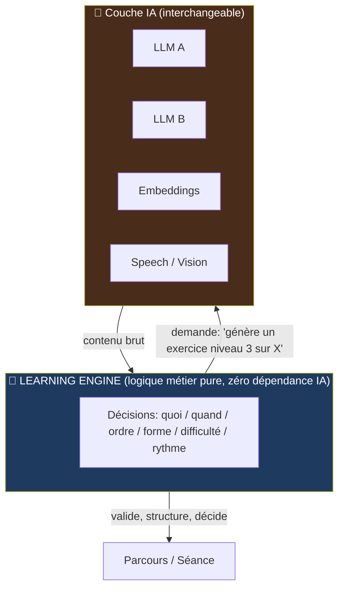

---

## 4. Vision en couches (Hexagonal + DDD)

Architecture **hexagonale (ports & adapters) + DDD**. Seule approche qui garantit le
découplage IA sur plusieurs années. **Règle de dépendance : tout pointe vers l'intérieur.**
Le domaine définit des *ports* (interfaces) ; l'infra les *implémente*.

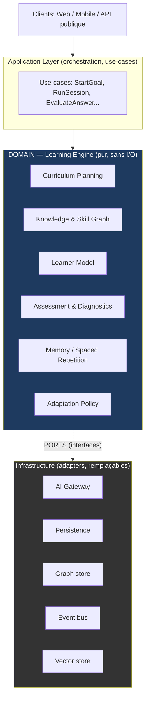

---

## 5. Bounded Contexts (carte stratégique)

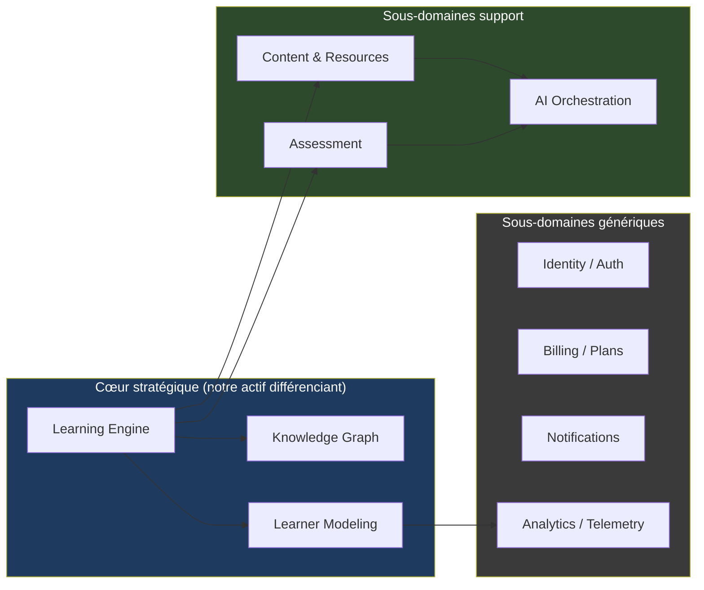

| Bounded Context | Responsabilité | Pourquoi séparé |
|---|---|---|
| **Learning Engine** | Décisions pédagogiques (planification, adaptation, séquençage) | Cœur, avantage concurrentiel. Doit rester pur. |
| **Knowledge Graph** | Représentation du savoir : concepts, compétences, prérequis | Domaine de données complexe, évolue indépendamment |
| **Learner Modeling** | Modèle de l'apprenant : niveau, historique, oublis, préférences | Données sensibles, logique probabiliste propre |
| **Assessment** | Diagnostics, évaluations, analyse d'erreurs | Logique de mesure isolée du séquençage |
| **Content & Resources** | Objets pédagogiques (LO), génération, curation | Pont vers l'IA, cache, versioning de contenu |
| **AI Orchestration** | Routage multi-modèles, abstraction fournisseurs | Toute la volatilité IA confinée ici |
| IAM / Billing / Notif / Analytics | Génériques | À acheter/réutiliser, pas à sur-investir |

---

## 6. Le Learning Engine en détail

Le moteur est organisé en **boucle de décision fermée** (sense → decide → act → learn),
inspirée des Intelligent Tutoring Systems et du contrôle adaptatif.

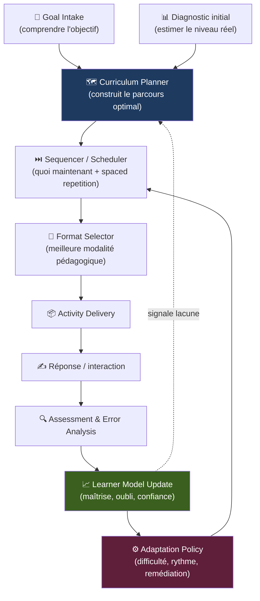

| Composant | Responsabilité |
|---|---|
| **Goal Intake** | Transforme un objectif flou (« devenir dev ») en objectif structuré (domaine, compétences cibles, niveau visé, contraintes). L'IA aide à parser ; la structure cible est notre schéma. |
| **Diagnostic / Level Estimator** | Évaluation adaptative initiale (idéalement IRT / CAT) pour situer l'apprenant sur le graphe sans lui faire perdre de temps. |
| **Curriculum Planner** | Chemin optimal dans le graphe de compétences respectant les prérequis (tri topologique + optimisation par effort/valeur). |
| **Sequencer / Scheduler** | Décide *quoi maintenant* : fusionne progression (nouveau) et révision (spaced repetition). |
| **Format Selector** | Choisit la modalité (texte, exercice, projet, flashcard, dialogue socratique, simulation) selon concept, contexte, efficacité passée. |
| **Assessment & Error Analysis** | Note, et surtout diagnostique le type d'erreur (misconception vs lapsus vs prérequis manquant). |
| **Learner Model Update** | Met à jour la maîtrise par compétence (BKT / DKT) + courbe d'oubli. |
| **Adaptation Policy** | Ajuste difficulté/rythme/remédiation. Règles explicites d'abord ; RL/bandits plus tard. |

> **Idée clé ajoutée : le « Mastery & Forgetting Model » unifié.** Chaque compétence = un état
> latent qui décroît dans le temps (oubli) et se renforce à chaque preuve de maîtrise. Cela unifie
> spaced repetition, détection de lacunes et estimation de niveau dans **un seul formalisme**.
> C'est le vrai cœur scientifique du produit (détaillé §8).

### 6.1 Goal Intake — du flou au structuré

L'utilisateur exprime un désir vague ; le moteur en extrait une **cible exploitable dans le graphe**,
sans jamais laisser le LLM « décider » de l'objectif.

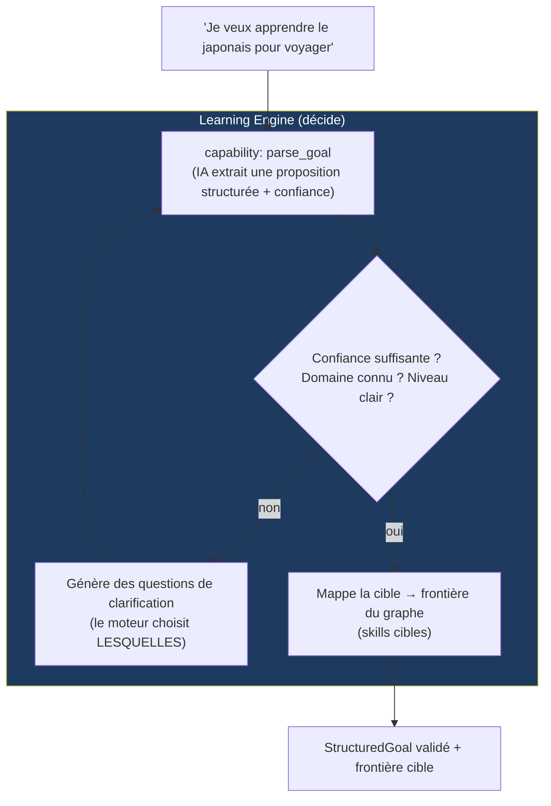

```typescript
type StructuredGoal = {
  id: string;
  domain: string;                    // 'japanese'
  rawStatement: string;              // texte original conservé
  targetSkills: string[];            // FRONTIÈRE cible dans le graphe
  targetLevel: string;               // 'N5' | 'conversational' | ...
  motivation?: string;               // voyage, travail, examen JLPT...
  constraints: {
    minutesPerDay?: number;
    deadline?: Date;
    preferredFormats?: Format[];
  };
  confidence: number;                // confiance du parsing (0..1)
  clarificationsNeeded: ClarificationQuestion[];
};
```

Points clés :
- L'IA (`parse_goal`) **propose** ; le **moteur valide** et décide s'il faut clarifier.
  Confiance basse / domaine inconnu / niveau ambigu → questions. **Le moteur choisit lesquelles**
  (politique métier) ; l'IA aide seulement à les formuler.
- La cible devient une **frontière du graphe** (`targetSkills`) — entrée du Planner.
- La `motivation` pondère les skills (« voyager » → oral/pratique ; « JLPT » → écrit/exhaustif).

### 6.2 Diagnostic adaptatif — placer l'apprenant, vite et bien

Deux difficultés propres au système : (1) ce n'est pas une échelle unidimensionnelle mais un
**graphe** (on veut une maîtrise **par région**, pas « un niveau ») ; (2) **cold start**
(ni historique apprenant, ni items calibrés au lancement).

**Trois approches comparées :**

| Approche | Principe | Avantages | Inconvénients | Verdict |
|---|---|---|---|---|
| **A. Test de placement fixe** | Batterie figée de N questions | Simple | Long, non personnalisé, ignore le graphe | ❌ |
| **B. IRT / CAT unidimensionnel** | θ = aptitude, item le plus informatif | Efficace, fondé | Réduit le domaine à **un seul axe** | 🟡 partiel |
| **C. Diagnostic adaptatif *graph-aware*** | IRT local + propagation bayésienne sur le graphe de prérequis (KST) | Peu de questions, sortie **par compétence**, exploite la structure | Plus complexe | ✅ **choisi** |

**Idée-clé (approche C) : exploiter le graphe pour inférer sans demander.**
Réussite d'un skill avancé → prérequis inférés maîtrisés. Échec d'un skill de base → dépendants
inférés non maîtrisés. Une bonne question élimine des dizaines de tests → diagnostic **court**.

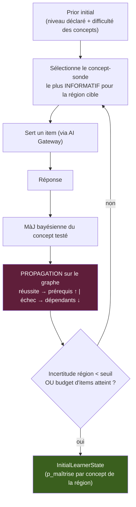

**Deux subtilités actées :**

1. **Cold start des items.** Pas de données calibrées au lancement →
   *bootstrap* de la difficulté depuis `concept.difficulty` + estimation experte ; *recalibration*
   (difficulté + pouvoir discriminant) par job hors-ligne quand les réponses s'accumulent.
   Le tout derrière un port → migration simple → IRT complet plus tard.
2. **Le placement n'a pas besoin d'être parfait.** Le diagnostic ne produit qu'un **prior** ;
   le modèle unifié Maîtrise+Oubli (§8) corrige la maîtrise à chaque interaction. On garde donc
   un diagnostic **court** (≈ 8–12 items max) et on laisse la boucle s'auto-corriger.
   Différenciateur vs tests de placement interminables.

**Passage de relais → Planner :**

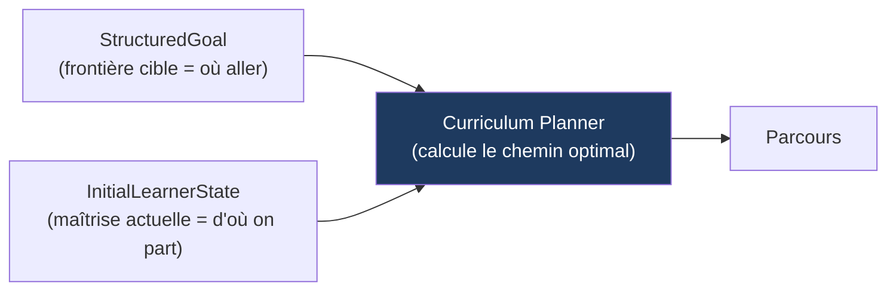

**Événements ajoutés :** `GoalSubmitted`, `GoalParsed`, `GoalClarificationRequested`,
`GoalConfirmed`, `DiagnosticStarted`, `DiagnosticItemAnswered`, `DiagnosticCompleted`,
`InitialStateEstimated`.

### 6.3 Curriculum Planner — du « où je suis / où je vais » au chemin optimal

Distinction fondamentale (évite le « thrashing ») :
- **Planner = stratégique / macro** : quel ensemble de skills, dans quel ordre approximatif ?
  Recalculé **rarement** (événements).
- **Sequencer = tactique / micro** (§9) : quelle activité **maintenant** ? Exécuté à chaque activité.

> Le Planner **ne produit pas un script rigide** : il produit un **espace contraint + des priorités**,
> et laisse le Sequencer décider au moment présent. Sur-spécifier tuerait l'adaptativité.

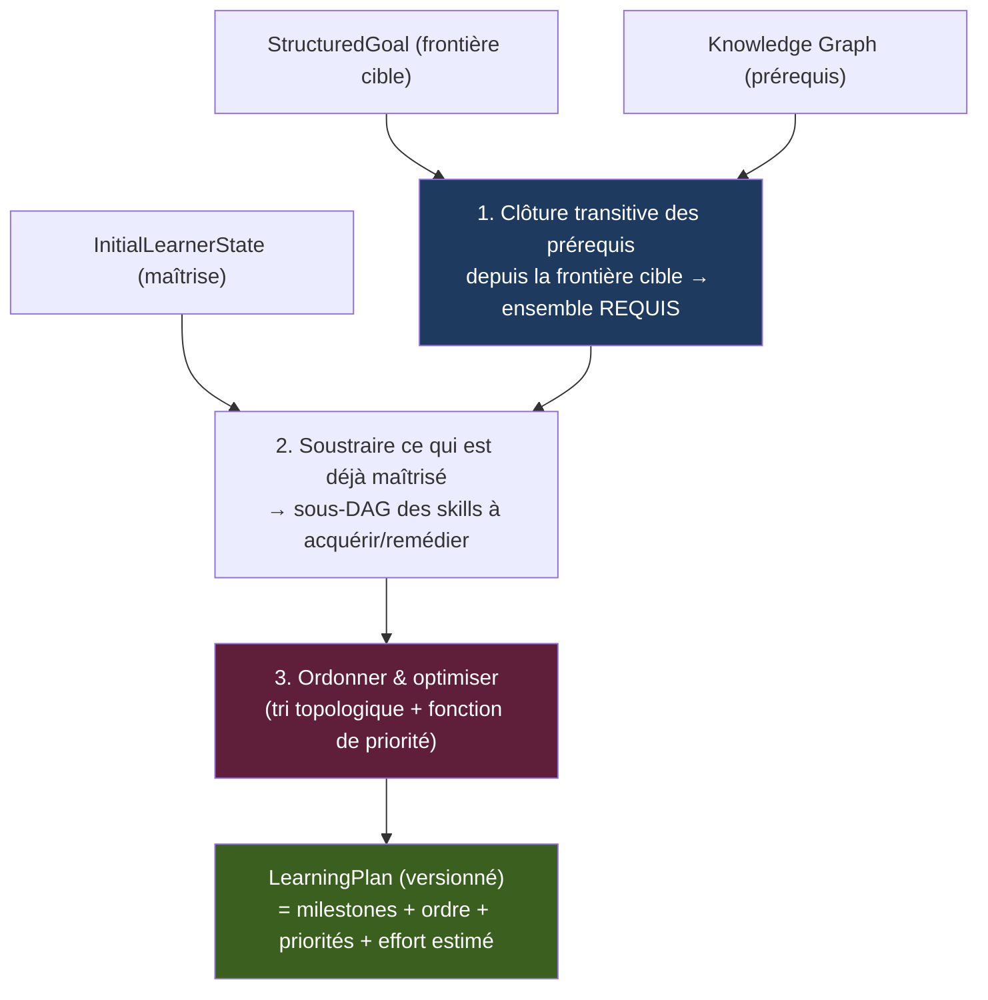

- **Étape 1 — ensemble requis** : clôture transitive des prérequis depuis la frontière cible.
- **Étape 2 — soustraire l'acquis** : retirer les skills maîtrisés (agrégation par concept > seuil) ;
  skill partiel → `to_remediate` (on ne retravaille que les concepts faibles). Résultat : un sous-DAG.
- **Étape 3 — ordonner & optimiser** : cœur algorithmique.

**Trois approches (étape 3) :**

| Approche | Principe | Avantages | Inconvénients | Verdict |
|---|---|---|---|---|
| **A. Tri topologique brut** | Respecte prérequis, ordre arbitraire | Trivial | Ignore effort/valeur/motivation | ❌ |
| **B. Tri topologique glouton pondéré** | Parmi les skills « prêts », prendre le meilleur score | Rapide, **interprétable**, bon équilibre | Optimum local | ✅ **au départ** |
| **C. Optimisation globale** (chemin critique / ILP) | Ordonnancement sous contrainte de deadline | Plus optimal, gère délais serrés | Complexe, moins explicable | 🎯 deadline critique |

> **Décision** : **B** d'abord (interprétable → on explique « pourquoi cet ordre »), évolution vers
> **C** pour la planification pilotée par deadline. Les deux derrière `PlannerStrategyPort`.

**Fonction de priorité (B) :**

```
priority(skill) =  w1 · pertinenceObjectif(skill, motivation)   // 'voyage' → vocab pratique
                 + w2 · (1 / effortEstimé)                       // quick wins → momentum
                 + w3 · valeurDeDéblocage(skill)                 // # de skills débloqués en aval
                 - w4 · profondeurRestante(skill)                // rester proche du front
```

- **`valeurDeDéblocage`** (leverage, type centralité sur le DAG) : apprendre d'abord ce qui ouvre
  le plus de portes.
- **Quick wins** : victoires rapides tôt → engagement.
- Les poids `w1..w4` sont **personnalisables** plus tard (appris par le Learner Model).

**Structures de données :**

```typescript
type LearningPlan = {
  id: string; goalId: string; learnerId: string;
  version: number;                  // versionné → traçabilité des re-planifications
  milestones: Milestone[];          // jalons/checkpoints
  skillOrder: PlannedSkill[];
  estimatedEffort: Duration;
  assumptions: PlanAssumptions;     // sert à détecter la DÉRIVE
};

type PlannedSkill = {
  skillId: string;
  status: 'mastered' | 'to_acquire' | 'to_remediate';
  priority: number;
  prerequisites: string[];
  estimatedEffort: Duration;
  rationale: string;                // POURQUOI ici — explicabilité pour l'utilisateur
};
```

Le `rationale` rend le plan **explicable** (« les kana d'abord car ils débloquent tout le reste »).

**Re-planification : macro vs micro (adaptation continue) :**

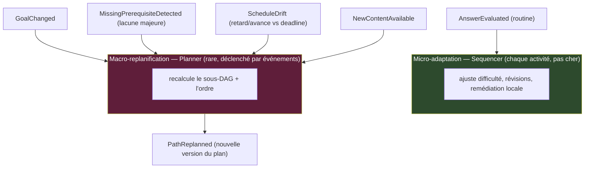

Re-planification **déclenchée par événement/seuil, débouncée, jamais en continu**. Les
micro-ajustements restent au Sequencer.

**Faisabilité & deadline** : le Planner compare l'effort total au budget
(`minutesPerDay × jours`). Si infaisable → il **remonte l'info** (réduire le périmètre / allonger
le délai / augmenter le rythme). Le moteur détecte et propose ; **l'utilisateur tranche**.
Estimation d'effort : heuristique (difficulté + nb concepts + format) au départ, affinée par la
télémétrie, derrière un port.

**Ports** : `KnowledgeGraphRepositoryPort`, `LearnerStateRepositoryPort`, `PlannerStrategyPort`
(algo swappable), `PlanRepositoryPort` (plans versionnés).
**Événements** : `PlanCreated`, `PathReplanned`, `MilestoneReached`, `GoalInfeasibleDetected`.

### 6.4 Assessment & Analyse d'erreurs — fermer la boucle

> **Scoring** (« est-ce correct ? ») ≠ **Diagnosis** (« *pourquoi* c'est faux ? »). La note vaut
> peu ; le **diagnostic** pilote remédiation, mise à jour de maîtrise et re-planification.

**1. Scoring : la bonne méthode au bon coût.** Méthode fiable la moins chère d'abord ;
l'IA seulement si indispensable. Décision du contexte Assessment (pas de l'AI Gateway).

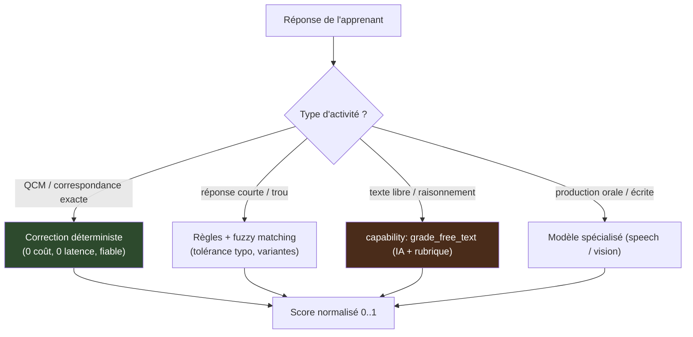

**2. On produit une ÉVIDENCE, pas un verdict.** Une réponse est un signal bruité. Le module renvoie
un objet riche, consommé par le Mastery model (§8) comme signal **gradué et pondéré**.

```typescript
type AssessmentEvidence = {
  activityId: string;
  conceptsCovered: string[];
  correct: boolean;
  score: number;              // 0..1
  errorType: ErrorType;
  attributedConcept?: string; // concept réellement fautif (peut ≠ concept testé)
  signals: {
    latencyMs: number;        // rapide+correct = fluide ; rapide+faux = lapsus/hasard
    usedHint: boolean;        // indice → preuve de maîtrise plus faible
    attempts: number;
    selfConfidence?: number;
  };
  evidenceWeight: number;     // 0..1 : fiabilité de la preuve pour le Mastery model
};
```

`evidenceWeight` : un hasard chanceux n'augmente presque pas la maîtrise ; un lapsus ne la baisse
presque pas ; une réponse avec indice vaut moins. **Connexion §8** : enrichit les paramètres
*guess/slip* natifs du BKT au lieu de les fixer globalement.

**3. Taxonomie d'erreurs (la nôtre — l'IA classe, le moteur décide) :**

| errorType | Signification | Décision du moteur |
|---|---|---|
| `correct` | Réussi | ↑ maîtrise (pondéré latence/confiance) |
| `slip` | Connaît, inattention | Ne quasi pas pénaliser |
| `guess` | Correct mais probablement aléatoire | `evidenceWeight` bas |
| `partial` | Incomplet | ↑ partiel ; cibler la partie manquante |
| `misconception` | Modèle mental erroné systématique | **Remédiation ciblée** |
| `missing_prerequisite` | Échec dû à un prérequis non maîtrisé | **Signaler au Planner** |

**4. Attribution (credit/blame sur le graphe).** Une activité teste souvent plusieurs concepts ;
un échec sur X peut venir d'un prérequis Y. On croise `conceptsCovered` + diagnostic + graphe pour
imputer au bon concept (`attributedConcept`) → `MissingPrerequisiteDetected` si c'est un prérequis.

**5. Bibliothèque de misconceptions (amélioration continue).** Catalogue de misconceptions connues
rattaché aux concepts (ex. JP : シ/ツ, は vs が). Détection par pattern → remédiation ciblée.
On **mine les erreurs agrégées** pour découvrir de nouvelles misconceptions → le moteur s'améliore
avec l'usage.


**6. Feedback : décision moteur, texte IA.** *Quand/quoi* renvoyer (immédiat vs différé, indice
progressif vs solution) est une décision pédagogique. Le moteur décide la stratégie ; l'IA produit
le texte.

**7. Le bouclage complet :**

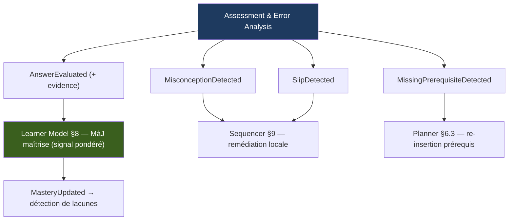

**Boucle fermée complète :** Goal → Diagnostic → Planner → Sequencer → Delivery → **Assessment**
→ Learner Model → adaptation/re-planification → Sequencer…

**Ports** : `GradingStrategyPort` (routage de correction, swappable), `MisconceptionCatalogPort`,
+ `ContentGeneratorPort`/`ExplanationPort` déjà définis.
**Événements** : `AnswerEvaluated`, `MisconceptionDetected`, `MissingPrerequisiteDetected`,
`SlipDetected`.

### 6.5 Format Selector — la 6e décision : « sous quelle forme »

> Le bon format dépend surtout de **l'intention pédagogique** (introduire / pratiquer / réviser /
> remédier / appliquer) et du **stade de maîtrise**, pas seulement du concept. Le Format Selector
> encode un **modèle pédagogique**, pas une table de correspondance.

**1. Le format suit la progression pédagogique** (testing effect, desirable difficulties,
expertise reversal, Bloom) :

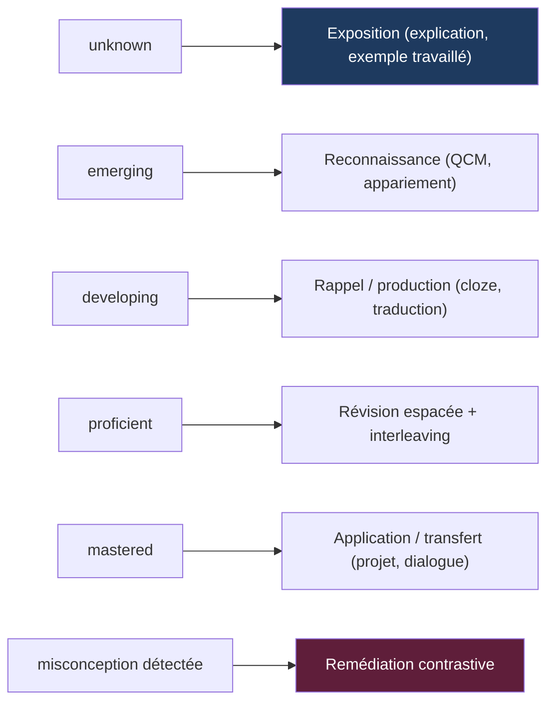

Le stade de maîtrise vient de §8 (`p_maîtrise` + stabilité) → choix **adaptatif** : le même concept
traverse ces bandes de format au fil du temps.

**2. Entrées de la décision :**

```typescript
type FormatDecisionContext = {
  concept: { id: string; type: 'kanji' | 'vocab' | 'grammar' };
  intent: 'introduce' | 'practice' | 'review' | 'remediate' | 'apply';
  masteryStage: 'unknown' | 'emerging' | 'developing' | 'proficient' | 'mastered';
  hasMisconception: boolean;
  learnerContext: {
    device: 'mobile' | 'desktop';
    availableMinutes: number;
    fatigueLevel?: number;
    formatPreferences?: Format[];
    recentFormats: Format[];             // variété (anti-monotonie)
    capabilities: { mic: boolean; camera: boolean };
  };
};

type FormatSpec = {
  format: Format;
  difficulty: number;                    // zone proximale (Learner Model)
  rationale: string;
  fallbackFormats: Format[];
};
```

**3. Approches comparées :**

| Approche | Principe | Avantages | Inconvénients | Verdict |
|---|---|---|---|---|
| **A. Mapping fixe** | Table statique type→format | Trivial | Ignore stade/contexte/apprenant | ❌ |
| **B. Politique à règles** (intent + stade + contexte) | Modèle pédagogique interprétable | Science encodée, explicable, marche sans données | Pas empiriquement optimal | ✅ **au départ** |
| **C. Bandit contextuel / RL** | Apprend format→résultat | Optimise empiriquement | Cold start, explicabilité, risque pédagogique | 🎯 plus tard |

> **Décision** : **B d'abord**, puis **C en surcouche comme bandit CONTRAINT** — il explore
> uniquement dans la **bande de formats pédagogiquement valides** définie par B (jamais « rappel
> avant exposition »). **B = plancher de sécurité.** Derrière `FormatSelectionStrategyPort`.

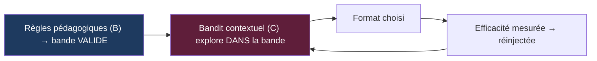

**4. Faisabilité & engagement** : format jouable ici/maintenant (pas de speaking sans micro,
court si peu de temps) ; charge réduite si fatigue ; **variété** (via `recentFormats`) ;
**interleaving** (rétention) ; préférences prises en compte **mais jamais au détriment de la
pédagogie** (desirable difficulties).

**5. Efficacité mesurée sur la RÉTENTION long terme, pas le score immédiat.** Piège : les formats
les plus efficaces à long terme (rappel actif) produisent souvent plus d'erreurs sur le moment.
On mesure donc le **gain de stabilité par minute** (§8) et la **rétention à N jours** — sinon on
optimiserait vers la facilité, contre l'apprentissage réel.

```typescript
type FormatEfficacyStat = {
  formatType: Format;
  conceptType: string;
  learnerSegment?: string;
  stabilityGainPerMinute: number;  // ← la vraie métrique (long terme)
  retentionAtDays: Record<number, number>;
};
```

**6. Sortie & relais** : le Format Selector choisit le format **abstrait** ; l'AI Gateway produit
le **contenu concret** (ou le sert du cache). Décision de forme (moteur) ≠ production (IA).

**Ports** : `FormatSelectionStrategyPort` (règles → bandit), `FormatEfficacyRepositoryPort`.
**Événements** : `FormatSelected`, `FormatEfficacyRecorded`.

> **Les 6 décisions fondamentales du moteur sont désormais conçues** : quoi (Planner),
> quand + rythme (Sequencer), ordre (Planner), difficulté (Learner Model + Adaptation),
> forme (Format Selector).

---

## 7. Représentation des connaissances

Trois couches distinctes à ne jamais confondre :

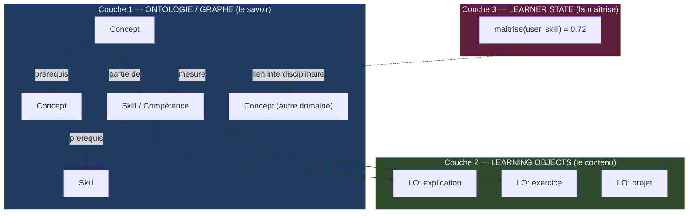

- **Couche 1 — Graphe connaissances/compétences** : nœuds = concepts & compétences ;
  arêtes = `prérequis`, `partie-de`, `généralise`, `analogue-à` (liens interdisciplinaires).
- **Couche 2 — Learning Objects (LO)** : unités pédagogiques réutilisables rattachées à des
  compétences. Un LO = {objectif, format, difficulté, contenu, métadonnées d'efficacité}.
  C'est ce que l'IA génère et qu'on cache/cure.
- **Couche 3 — État de l'apprenant** : superposé au graphe, par utilisateur
  (maîtrise, fraîcheur mémoire, confiance).

### Deux granularités : Skill vs Concept

- **Skill (compétence)** : nœud gros grain du parcours, porteur des relations de prérequis.
  C'est sur quoi le **Planner** raisonne.
- **Concept (KC – Knowledge Component)** : atome de savoir testable. C'est sur quoi le
  **Learner Model** mesure maîtrise et oubli. *Un skill = un ensemble de concepts.*

Cette séparation permet de **planifier « gros »** (parcours lisible) tout en
**mesurant « fin »** (maîtrise précise, révisions ciblées).

### Schéma conceptuel (indépendant de la base)

```
Concept(id, type[kana|kanji|vocab|grammar], payload, difficulty)
Skill(id, title, description)
SkillPrerequisite(skill_id, requires_skill_id, strength)
SkillConcept(skill_id, concept_id)
ConceptRelation(from_id, to_id, type[prerequisite|analogous|generalizes])

LearningObject(id, concept_id|skill_id, format, difficulty, content_ref, efficacy_stats)
```

### Choix de stockage du graphe (compromis)

| Option | Avantages | Inconvénients | Verdict |
|---|---|---|---|
| **Graph DB** (Neo4j) | Requêtes de chemin natives | Nouvelle techno à opérer | ✅ quand le graphe grossit |
| **PostgreSQL + recursive CTE** | Une base, transactions, connu | Requêtes de graphe verbeuses | ✅ **au début** |
| **PG + extension AGE** | Cypher dans Postgres | Extension moins mature | 🟡 compromis |

> **Décision** : démarrer **PostgreSQL**, cacher l'accès derrière `KnowledgeGraphRepositoryPort`.
> Basculer vers Neo4j plus tard sans toucher le domaine.

### Domaine pilote : Japonais N5

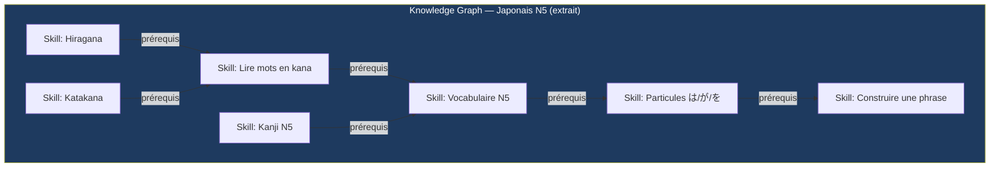

**Pourquoi le japonais N5 comme pilote** : c'est le domaine qui stresse le plus de composants,
notamment le **modèle mémoire/oubli** (cœur scientifique). Assessment largement objectif
(on évite « noter un raisonnement » en v1), graphe de prérequis limpide, formats variés
(reconnaissance, rappel, production, écoute → test idéal du Format Selector).

---

## 8. Le cœur scientifique : modèle Maîtrise + Oubli

La plupart des produits échouent en traitant « ai-je appris ? » (BKT) et « vais-je oublier ? »
(SM-2/Anki) séparément. **On les unifie en un seul état latent par (apprenant, concept).**

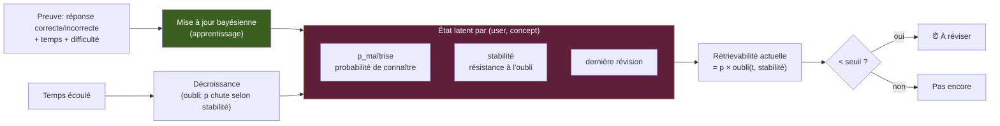

Deux idées scientifiquement éprouvées combinées :

1. **Apprentissage (BKT-like)** : chaque preuve met à jour bayésiennement `p_maîtrise`.
   Une bonne réponse augmente aussi la **stabilité** (consolidation).
2. **Oubli (FSRS / Ebbinghaus)** : entre deux révisions, la **rétrievabilité** décroît
   exponentiellement, à vitesse inversement proportionnelle à la **stabilité**. Réviser au bon
   moment augmente la stabilité et allonge l'intervalle suivant.

**Ce seul modèle alimente d'un coup :**
- la **détection de lacunes** (`p_maîtrise` bas) ;
- la **planification des révisions** (rétrievabilité < seuil → `ReviewDue`) ;
- l'**estimation du niveau** (agrégation des `p` sur les concepts d'un skill) ;
- l'**adaptation de difficulté** (contenu calibré juste au-dessus de la maîtrise — zone proximale).

> **Implémentation recommandée** : démarrer avec **FSRS** (open-source, état de l'art, supplante
> SM-2/Anki) pour l'oubli, couplé à une mise à jour bayésienne simple pour la maîtrise. Léger,
> **implémentable en TypeScript**, interprétable, sans dépendance ML. Interface `MasteryModelPort`
> pour remplacer par un réseau **DKT** (Python) plus tard sans toucher au reste.

---

## 9. Le Sequencer

Arbitre en permanence entre **apprendre du neuf** et **consolider l'ancien**.

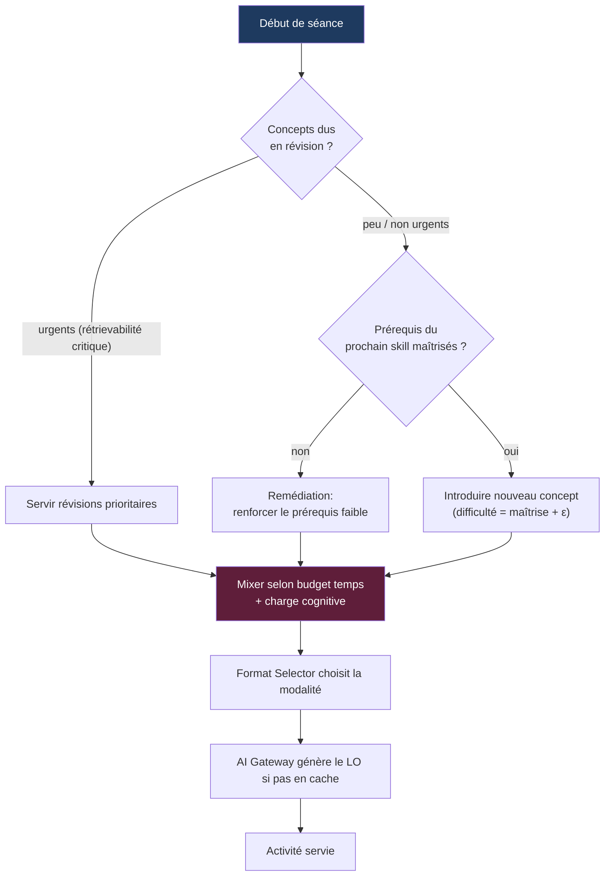

Logique clé, **entièrement dans notre code** (l'IA n'intervient qu'à la fin pour produire le contenu) :
- **Priorité absolue aux révisions urgentes** (sinon l'apprenant oublie — erreur n°1 des apps de cours).
- **Respect strict des prérequis** (tri topologique sur le graphe).
- **Difficulté = maîtrise actuelle + petit incrément** (zone proximale, ni ennui ni décrochage).
- **Budget temps & charge cognitive** : dose le ratio neuf/révision selon temps dispo et fatigue inférée.

---

## 10. Couche d'orchestration IA (AI Gateway)

Un **AI Gateway interne** avec routage par *capability* (pas par fournisseur).
C'est le maillon qui confine **toute** la volatilité IA hors du domaine.

### 10.1 Deux niveaux d'abstraction (à ne pas confondre)

Il existe **deux niveaux** distincts, reliés par un adapter :

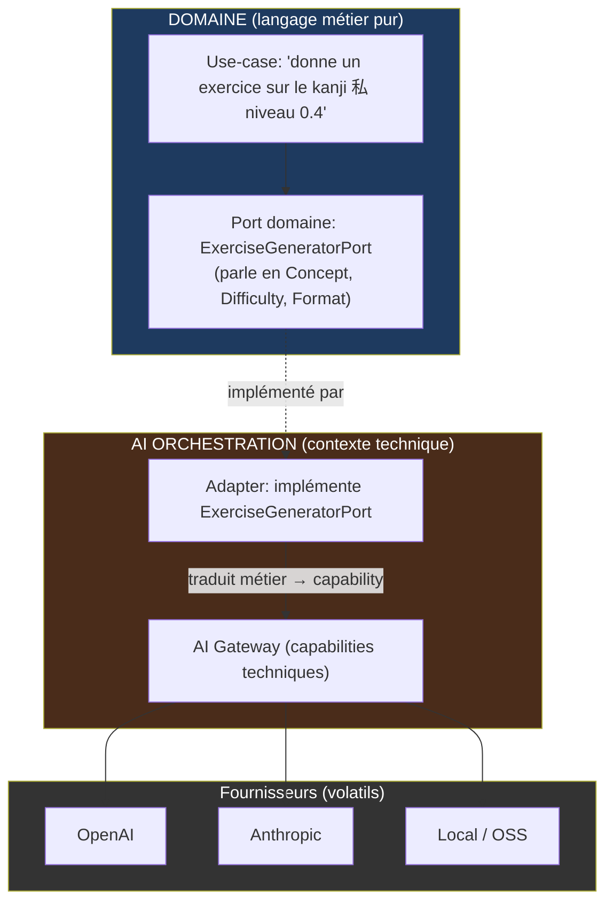

- **Niveau 1 — Ports domaine** (`ExerciseGeneratorPort`, `AnswerGraderPort`, `ExplanationPort`,
  `TutorDialoguePort`, `EmbeddingPort`) : exprimés en **vocabulaire métier pur**
  (Concept, Skill, Difficulty). Le domaine ne connaît qu'eux. **Aucune mention de prompt,
  de modèle, de fournisseur.**
- **Niveau 2 — Capabilities techniques** du Gateway (`generate_exercise`, `grade_free_text`,
  `explain_concept`, `embed`…) : gèrent prompts, modèles, validation. Vivent dans le contexte
  **AI Orchestration**.

Un **adapter** fait le pont. Ce double niveau garantit que même l'existence d'un « prompt »
est invisible au domaine.

### 10.2 Anatomie interne du Gateway

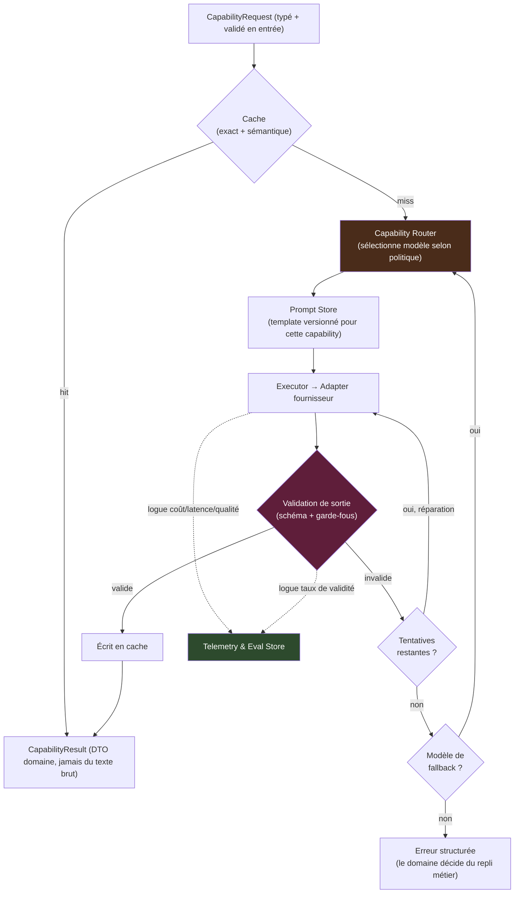

| Composant | Rôle |
|---|---|
| **Capability Registry** | Déclare chaque capacité + ses schémas I/O. Source de vérité des contrats. |
| **Model Registry** | Config déclarative : capacité → liste ordonnée de modèles candidats + stratégie. |
| **Capability Router** | Choisit le modèle selon la politique (qualité / coût / latence / dispo). |
| **Prompt Store** | Templates de prompt **versionnés**, séparés du domaine. Le prompt est un artefact. |
| **Executor** | Appelle l'adapter fournisseur choisi. |
| **Validator + Repair** | Valide sortie (schéma + garde-fous). Répare (re-ask) puis fallback. |
| **Cache** | Exact + sémantique. Clé = hash(capability + input normalisé + version prompt + modèle). |
| **Telemetry / Eval** | Logue coût, latence, validité, qualité → routage piloté par les données. |
| **Adapters** | Un par fournisseur. Seul endroit qui connaît l'API concrète. |

### 10.3 Contrat d'une capability

Chaque capacité = **schéma d'entrée validé** + **schéma de sortie validé**. Contrat immuable
quel que soit le modèle derrière.

```typescript
interface Capability<Input, Output> {
  name: string;                 // 'generate_exercise'
  inputSchema: Schema<Input>;   // validé AVANT appel modèle
  outputSchema: Schema<Output>; // validé APRÈS appel modèle
  routing: RoutingPolicy;       // 'quality' | 'cost' | 'latency' | custom
  cache: CachePolicy;           // ttl, sémantique on/off
}
```

Exemple — génération d'exercice (pilote Japonais N5) :

```typescript
type GenerateExerciseInput = {
  concept: { id: string; type: 'kanji' | 'vocab' | 'grammar'; payload: unknown };
  format: 'mcq' | 'recall' | 'translation' | 'listening';
  difficulty: number;              // 0..1, calibré par le Learner Model
  learnerContext: { nativeLanguage: string; knownConcepts: string[] };
};

type GenerateExerciseOutput = {
  items: Array<{
    prompt: string;
    choices?: string[];
    correctAnswer: string;
    rationale: string;
    conceptsCovered: string[];
    estimatedDifficulty: number;
  }>;
};
```

Exemple — correction & diagnostic d'erreur (l'IA classe *dans notre taxonomie* ;
le domaine décide de la remédiation) :

```typescript
type GradeAnswerOutput = {
  correct: boolean;
  score: number;                   // 0..1
  errorType:
    | 'none' | 'typo'              // lapsus → ne pénalise pas la maîtrise
    | 'partial'
    | 'misconception'              // erreur conceptuelle → remédiation ciblée
    | 'missing_prerequisite';      // → signale une lacune au Planner
  diagnosis: string;
  feedback: string;
};
```

> L'IA **classe** l'erreur dans une taxonomie **que nous définissons**. La décision
> (pénaliser la maîtrise ? remédier ? re-planifier ?) reste dans le Learning Engine.

### 10.4 Routage par capacité (Model Registry déclaratif)

Routage **par capacité**, pas par fournisseur. Ajouter/changer un modèle = éditer une config.

```yaml
capabilities:
  grade_free_text:
    strategy: quality          # correction = précision critique
    models: [claude-primary, gpt-fallback]
  generate_exercise:
    strategy: balanced
    models: [gpt-primary, claude-fallback, local-oss]
    cache: { semantic: true, ttlDays: 90 }
  embed:
    strategy: cost             # volume élevé → le moins cher
    models: [embed-small]
```

Stratégies : **quality** (correction, diagnostic), **cost/latency** (embeddings, masse),
**data-driven** (futur : choix d'après métriques réelles).

### 10.5 Validation & boucle de réparation

```mermaid
sequenceDiagram
    participant Ad as Adapter (domaine)
    participant GW as Gateway
    participant M as Modèle
    participant V as Validator

    Ad->>GW: execute(generate_exercise, input)
    GW->>GW: valide input (schéma) — sinon rejet immédiat
    GW->>M: prompt (template versionné) + contrainte format JSON
    M-->>GW: réponse brute
    GW->>V: valide contre outputSchema + garde-fous
    alt sortie valide
        V-->>GW: OK → DTO domaine
        GW-->>Ad: CapabilityResult typé
    else sortie invalide (tentatives restantes)
        V-->>GW: erreurs de schéma
        GW->>M: re-ask "corrige selon ces erreurs"
    else épuisé → fallback
        GW->>GW: passe au modèle suivant du registry
    end
```

**Garantie : rien de non validé n'atteint le domaine.** Entrée validée avant appel (échec rapide),
sortie validée après (réparation → fallback → erreur structurée). Le domaine gère l'erreur comme
un cas métier (ex. « pas d'exercice IA dispo → sers une flashcard du cache »).

### 10.6 Cache, prompts versionnés, observabilité

- **Cache** : exact (hash) + sémantique (similarité d'embeddings sur l'entrée) → réutilisation de
  contenu, coûts réduits, latence quasi nulle.
- **Prompt Store versionné** : les prompts sont des artefacts (id + version) → A/B test, rollback ;
  le hash de version entre dans la clé de cache (changer le prompt invalide proprement le cache).
- **Telemetry & Eval** : chaque appel logue capacité, modèle, coût, latence, validité 1er essai,
  (plus tard) score qualité → changer de modèle par les données, pas par intuition.

### 10.7 Point d'extension : ajouter un fournisseur

```typescript
interface ModelAdapter {
  id: string;
  supports: CapabilityKind[];              // ce qu'il sait faire
  invoke(req: NormalizedRequest): Promise<NormalizedResponse>;
}
```

**Ajouter un modèle futur = 2 gestes :** (1) écrire un `ModelAdapter`, (2) l'ajouter dans le
Model Registry (config). **Zéro ligne touchée** dans le domaine, les use-cases ou les autres adapters.

### 10.8 Évaluation & sélection des modèles (routage data-driven)

Traiter les modèles comme interchangeables exige de les **mesurer rigoureusement** : la qualité LLM
est subjective, les fournisseurs changent leurs modèles sous nos pieds, et on part sans données.

> **Insight différenciateur** : la métrique ultime n'est pas « la sortie est-elle belle ? » mais
> **« a-t-elle fait apprendre ? »**. On mesure l'**effet pédagogique réel** (gain de maîtrise §8,
> efficacité §6.5) — un avantage structurel que les évals LLM génériques n'ont pas.

**Évaluation en 3 couches :**

```mermaid
flowchart TB
    subgraph OFFLINE["1. Offline — Golden sets (portail CI)"]
        GS["Cas curés par capacité"] --> SCORE["Scoring automatique"] --> CARD1["Scorecard (avant prod)"]
    end
    subgraph GUARD["2. Garde-fous — always-on (loggés §12)"]
        VAL["Validité 1er essai"]
        FB["Taux de fallback"]
        COST["Coût / latence"]
    end
    subgraph ONLINE["3. Online — résultat d'apprentissage (arbitre ultime)"]
        AB["A/B / canary / shadow"] --> OUT["Gain de maîtrise attribué"] --> CARD2["Scorecard enrichie"]
    end
    CARD1 --> REG["Model Registry (routage data-driven §10.4)"]
    GUARD --> REG
    CARD2 --> REG

    style ONLINE fill:#3a5f1e,color:#fff
    style REG fill:#4a2c1a,color:#fff
```

| Couche | Rôle | Méthodes |
|---|---|---|
| **1. Golden sets offline** | CI des modèles ; régressions avant prod | structurel/déterministe, référence (embedding/exact), LLM-as-judge, humain (calibrage) |
| **2. Garde-fous always-on** | Santé continue | validité 1er essai, fallback, coût, latence (`ai_call_log`) |
| **3. Résultat online** | Vérité terrain | A/B/canary → gain de maîtrise réel |

**Approches :** éval manuelle ❌ (ni reproductible ni scalable) ; **golden sets + scoring auto +
LLM-judge** ✅ socle (portail CI) ; **éval online par résultat d'apprentissage** ✅ arbitre ultime.
Le LLM-as-judge est **calibré contre des labels humains** (suivi de l'accord juge↔humain).

**Détection de régression :**

```mermaid
flowchart LR
    PIN["Épingler la version du modèle si possible"] --> MON["Monitoring par (capacité, modèle)"]
    MON --> DRIFT{"Dérive ? (validité↓ / qualité↓ / coût↑)"}
    DRIFT -->|oui| RERUN["Rejouer les golden sets auto"] --> ALERT["Alerte + re-routage éventuel"]

    style DRIFT fill:#5f1e3a,color:#fff
```

**Structures & boucle fermée :**

```typescript
type EvalCase = {
  id: string; capability: string;
  input: unknown;
  expected?: unknown;        // scoring par référence
  rubric?: Rubric;           // LLM-as-judge / humain
  tags: string[];            // segments, cas limites
};

type ModelScorecard = {
  modelId: string; capability: string;
  quality: number;           // score agrégé (golden set)
  validityRate: number;      // % schéma valide 1er essai
  avgCostPerCall: number;
  p95LatencyMs: number;
  learningOutcome?: number;  // gain de maîtrise attribué (online)
  goldenSetVersion: string;
  evaluatedAt: string;
};
```

Les `ModelScorecard` alimentent la politique de routage du Model Registry → routage **data-driven**
(§10.4). Boucle fermée : on route vers ce qui **fait le mieux apprendre au meilleur coût**.

**Cold start** : golden sets amorcés (experts + cas générés par IA) puis **enrichis des échecs réels
de prod** (sorties invalides, contenus à faible gain de maîtrise) — même logique de minage que les
misconceptions (§6.4).

**Ports** : `EvalHarnessPort`, `LlmJudgePort`, `ModelScorecardRepositoryPort`.
**Événements** : `ModelEvaluated`, `ModelRegressionDetected`, `RoutingPolicyUpdated`.

---

## 11. Modèle de l'apprenant & personnalisation

« Le moteur apprend autant sur l'utilisateur que l'inverse. » Deux registres + un journal.

- **Profil explicite** : objectifs, contraintes, préférences déclarées.
- **Profil inféré** : style efficace (déduit des résultats), rythme optimal, heures de performance,
  modalités efficaces, points faibles récurrents.
- **Événements bruts (event log)** : chaque interaction = événement immuable → permet de
  **recalculer** les modèles quand on les améliore, et d'entraîner de futurs modèles.

> **RGPD by design** : les données comportementales vivent dans le contexte **Learner Modeling**,
> isolées, chiffrées, pseudonymisées, séparées des données identifiantes (IAM).
> Droit à l'oubli = suppression d'un agrégat localisé.

---

## 12. Flux de données & événements

Architecture **orientée événements en interne** (pas forcément microservices).
Chaque fait pédagogique = un événement → découplage temporel, traçabilité, recalcul, analytics.

```mermaid
sequenceDiagram
    participant U as Apprenant
    participant App as Application
    participant LE as Learning Engine
    participant AI as AI Gateway
    participant Bus as Event Bus
    participant LM as Learner Model

    U->>App: Soumet une réponse
    App->>LE: EvaluateAnswer(activity, answer)
    LE->>AI: capability: grade_free_text (si besoin)
    AI-->>LE: résultat structuré + validé
    LE->>Bus: publie "AnswerEvaluated" / "MisconceptionDetected"
    Bus->>LM: met à jour maîtrise + courbe d'oubli
    LM->>Bus: publie "MasteryUpdated"
    Bus->>LE: déclenche re-séquençage / remédiation
    LE-->>App: prochaine activité optimale
    App-->>U: Séance suivante
```

### 12.1 Persistance hybride : état courant + journal d'événements

Deux extrêmes à éviter : tout en état (on perd l'histoire → impossible de recalculer les modèles)
ou tout en event sourcing (lourd partout, y compris là où ça n'apporte rien).

> **Décision : hybride sélectif.** État courant pour ce qui se requête (plans, graphe, profil) **et**
> un **journal d'événements append-only** (analytics, audit, replay, entraînement futur). Le journal
> d'interactions est un **actif de premier ordre** — il matérialise « le moteur apprend autant que
> l'apprenant ».

### 12.2 Event sourcing *sélectif* : la maîtrise

Là où le replay a une valeur claire, on va plus loin. La maîtrise est *dérivée* d'une séquence
de preuves :

> Les **evidence events** sont la **source de vérité** ; l'état de maîtrise (`p_maîtrise`, stabilité)
> n'est qu'une **projection recalculable**.

```mermaid
flowchart LR
    E["evidence_event (append-only)<br/>SOURCE DE VÉRITÉ"] -->|projection| M["mastery_state (snapshot)<br/>lecture rapide"]
    E -.replay avec nouvel algo.-> M2["Nouvelle projection (BKT → DKT)"]

    style E fill:#3a5f1e,color:#fff
    style M2 fill:#5f1e3a,color:#fff
```

Bénéfice décisif : remplacer BKT par DKT (Phase 6) = **rejouer tout l'historique de preuves** pour
recalculer la maîtrise, sans rien perdre. Les autres agrégats (Goal, Plan, Graph) restent
state-based avec émission d'événements pour l'intégration.

### 12.3 Outbox pattern : fiabilité de la publication

Évite le « dual write » (état modifié puis événement publié en 2 temps → incohérence sur crash).

```mermaid
flowchart TB
    TX["Transaction unique"] --> ST["1. Écrit l'état (mastery_state...)"]
    TX --> OB["2. Écrit la ligne OUTBOX (même TX)"]
    ST -.commit atomique.-> OB
    OB --> RELAY["Relay (poll/CDC)"]
    RELAY -->|lit outbox non publiés| BUS["Event Bus"]
    BUS --> CONS["Consommateurs idempotents (via eventId)"]

    style OB fill:#4a2c1a,color:#fff
    style BUS fill:#1e3a5f,color:#fff
```

État + intention de publier écrits dans la **même transaction** ; publication at-least-once →
consommateurs **idempotents**. In-process au début, prêt pour Kafka.

### 12.4 CQRS-lite : projections pour la lecture

Pas de CQRS dogmatique. Là où les lectures divergent des écritures (« concepts à réviser
maintenant », dashboards, analytics), on construit des **projections** depuis les événements.
Le reste = lecture directe. Pragmatisme d'abord.

### 12.5 Catalogue d'événements consolidé

`📌 Fait` = append-only à forte valeur de replay ; `🔗 Intégration` = déclenche d'autres contextes.

| Contexte | Événements |
|---|---|
| **Goal & Planning** | `GoalSubmitted` 📌, `GoalParsed`, `GoalConfirmed`, `GoalInfeasibleDetected` 🔗, `PlanCreated`, `PathReplanned` 🔗, `MilestoneReached` 🔗 |
| **Diagnostic** | `DiagnosticStarted`, `DiagnosticItemAnswered` 📌, `DiagnosticCompleted`, `InitialStateEstimated` 🔗 |
| **Session & Delivery** | `FormatSelected`, `ActivityDelivered` 📌 |
| **Assessment** | `AnswerEvaluated` 📌🔗, `MisconceptionDetected` 🔗, `MissingPrerequisiteDetected` 🔗, `SlipDetected` |
| **Learner Model** | `MasteryUpdated` 🔗, `ReviewDue` 🔗, `GapDetected` 🔗 |
| **Content & AI** | `ContentGenerated`, `FormatEfficacyRecorded` 📌, `ModelCallLogged` 📌 |

### 12.6 Enveloppe d'événement standard (versionnée)

```typescript
type DomainEvent<T> = {
  eventId: string;          // UUID — idempotence côté consommateur
  type: string;             // 'AnswerEvaluated'
  schemaVersion: number;    // évolution de schéma sans casser les anciens
  aggregateType: string;    // 'LearnerMastery'
  aggregateId: string;
  occurredAt: string;       // ISO — temps métier
  correlationId: string;    // trace une session / un parcours
  causationId?: string;     // l'événement qui a causé celui-ci → traçabilité causale
  payload: T;
};
```

`correlationId` + `causationId` = **traçabilité causale complète** (« cette re-planification vient
de cette misconception, détectée sur cette réponse »).

### 12.7 Propriété des données par contexte (schémas clés)

> **Règle stricte : chaque bounded context possède ses tables. Aucune FK inter-contextes — on
> référence par ID.** C'est ce qui permet d'extraire un contexte en service plus tard sans démêler
> des jointures.

```sql
-- Knowledge Graph
concept(id, type, payload jsonb, difficulty, version)
skill(id, title, domain)
skill_prerequisite(skill_id, requires_skill_id, strength)   -- le DAG
skill_concept(skill_id, concept_id)
misconception(id, concept_id, pattern jsonb, description)
learning_object(id, target_ref, format, difficulty, content_ref, efficacy jsonb, version)

-- Learner Modeling
learner_profile(learner_id, explicit jsonb, inferred jsonb, updated_at)
evidence_event(id, learner_id, concept_id, occurred_at,
               correct, score, error_type, signals jsonb, evidence_weight)   -- APPEND-ONLY (vérité)
mastery_state(learner_id, concept_id, p_mastery, stability, last_reviewed_at) -- PROJECTION

-- Planning
learning_goal(id, learner_id, domain, target_skills jsonb, target_level, motivation, constraints jsonb)
learning_plan(id, goal_id, learner_id, version, milestones jsonb, assumptions jsonb, created_at)
planned_skill(plan_id, skill_id, status, priority, estimated_effort, rationale)

-- AI Orchestration
prompt_template(id, capability, version, template)                 -- versionné
ai_call_log(id, capability, model_id, cost, latency_ms, valid_first_try, occurred_at)
content_cache(cache_key, capability, prompt_version, model_id, output jsonb, embedding vector)

-- Cross-cutting
outbox(id, event_type, aggregate_id, payload jsonb, occurred_at, published_at)
domain_event(event_id, type, aggregate_type, aggregate_id, schema_version,
             occurred_at, correlation_id, causation_id, payload jsonb)        -- le journal
```

### 12.8 Vue d'ensemble du flux

```mermaid
flowchart TB
    subgraph WRITE["Write model (agrégats, une TX)"]
        AGG["Agrégats de domaine"] --> OBX["outbox"]
    end
    OBX --> RELAY["Relay"] --> BUS["Event Bus (in-process → Kafka)"]
    BUS --> PROJ["Projections (mastery_state, dashboards, 'à réviser')"]
    BUS --> LOG["domain_event (journal append-only)"]
    LOG --> ANALYTICS["Analytics / minage misconceptions / recalibration items"]
    LOG --> REPLAY["Replay → recalcul des modèles (BKT→DKT)"]

    style WRITE fill:#1e3a5f,color:#fff
    style LOG fill:#3a5f1e,color:#fff
    style REPLAY fill:#5f1e3a,color:#fff
```

> Event bus **in-process** (simple, transactionnel) au début, puis **outbox → Kafka/Redpanda** au scale.

---

## 13. Sécurité, confidentialité & conformité

Cross-cutting, à poser **avant** le code. Prolonge directement le modèle de données (§12).

### 13.1 Classification des données

| Catégorie | Exemples | Sensibilité | Contexte propriétaire |
|---|---|---|---|
| **Identité (PII)** | email, nom, auth | Élevée | IAM |
| **Comportementale / apprentissage** | evidence events, maîtrise, objectifs, profil inféré | **Très élevée** (profil cognitif) | Learner Modeling |
| **Contenu** | LO générés, graphe | Faible | Knowledge / Content |
| **Logs IA** | prompts, réponses | Variable (PII possible) | AI Orchestration |

### 13.2 Séparation identité / comportement (pseudonymisation native)

```mermaid
flowchart LR
    subgraph IAM["IAM (seul à connaître l'identité réelle)"]
        MAP["learner_id  ↔  email/nom"]
    end
    subgraph LM["Learner Modeling (pseudonyme)"]
        DATA["evidence_event, mastery_state...<br/>clés uniquement par learner_id"]
    end
    MAP -.la seule table de liaison.-> DATA

    style IAM fill:#5f1e3a,color:#fff
    style LM fill:#1e3a5f,color:#fff
```

> Le store comportemental ne contient **jamais** d'identifiant direct : tout est clé par un
> `learner_id` **pseudonyme**. La correspondance `learner_id ↔ personne` vit **uniquement** dans IAM.

### 13.3 Effacement vs journal immuable → crypto-shredding

Un log append-only ne peut être modifié ligne par ligne. Réconciliation : **effacement
cryptographique**.

```mermaid
flowchart TB
    subgraph NORMAL["Fonctionnement normal"]
        K["Clé par apprenant (KMS)"] --> ENC["Payload chiffré dans le journal"]
        ENC --> READ["Déchiffrement à la lecture / projection"]
    end
    ERASE["Droit à l'oubli"] --> DESTROY["Détruire la clé de l'apprenant"]
    DESTROY --> RESULT["Journal structurellement intact,<br/>payloads illisibles à jamais"]

    style DESTROY fill:#5f1e3a,color:#fff
    style RESULT fill:#3a5f1e,color:#fff
```

- Clé de chiffrement dédiée par apprenant (envelope encryption / KMS) ; données sensibles chiffrées
  avec elle.
- « Effacer » = **détruire la clé** → données irrécupérables, **sans casser l'append-only** (ADR-024/025).
- Les agrégats **déjà anonymisés** (stats misconceptions, efficacité formats) ne sont plus des
  données personnelles → peuvent rester pour améliorer le moteur.

### 13.4 L'AI Gateway comme point de contrôle unique de la fuite

Bénéfice de §10 : seul point de sortie vers des modèles tiers → on y applique la protection.
- **Minimisation & rédaction PII** avant envoi externe : contexte pseudonyme et minimal, jamais d'identité.
- **Routage sensible → modèle auto-hébergé** (config Model Registry), sans changer le domaine.
- **DPA fournisseurs** + opt-out d'entraînement sur nos données ; rétention des logs IA limitée.

### 13.5 Droits RGPD → architecture

| Droit | Mise en œuvre |
|---|---|
| **Accès / portabilité** | Export par `learner_id` (profil + maîtrise + historique) |
| **Rectification** | Profil explicite éditable ; inféré recalculé par replay |
| **Effacement** | Crypto-shredding + suppression du lien IAM |
| **Opposition / limitation** | Flag de consentement désactivant le profilage inféré (retour aux règles) |
| **Transparence** | Les `rationale` (plan, format, feedback) rendent les décisions explicables |

> L'explicabilité exigée pour des raisons **pédagogiques** sert aussi la **conformité**.

### 13.6 Conformité spécifique à l'éducation

- **COPPA / mineurs** : < 13 ans (voire 15/16 en UE) → **age-gating** + **consentement parental**.
  À anticiper dans le modèle de données (âge, consentement, comptes rattachés).
- **FERPA** (US) et équivalents pour la vente aux établissements.
- **Multi-tenant B2B** : isolation par tenant (Row-Level Security Postgres / schéma dédié),
  à prévoir tôt (coûteux à rajouter après).

### 13.7 Sécurité & éthique du modèle

- **AuthN/AuthZ** : RBAC/ABAC ; le `domain_event` log sert de **piste d'audit**.
- **Secrets** : KMS/coffre ; clés fournisseurs IA confinées au Gateway.
- **Équité (fairness)** : surveillance de biais des estimations de niveau par segment
  (langue maternelle, âge…) — devoir éthique, car cela impacte l'apprentissage réel.

**Ports** : `EncryptionKeyPort` (KMS, crypto-shredding), `PiiRedactionPort` (Gateway), `ConsentPort`.
**Événements** : `ConsentGranted`, `ConsentRevoked`, `ErasureRequested`, `DataExported`.

---

## 14. Portabilité multi-domaines

Test de robustesse : le moteur, conçu sur le japonais N5, tient-il pour des domaines radicalement
différents ?

### 14.1 Le test : 4 domaines volontairement dissemblables

| Axe | Japonais | Programmation | Physique | Cuisine |
|---|---|---|---|---|
| **Type de savoir** | déclaratif + procédural | procédural | conceptuel | gestuel/incarné |
| **Prérequis** | stricts, nets | multiples chemins, flous | profonds (maths) | souples |
| **Observabilité de l'éval** | objective (auto) | auto (tests) + rubrique | subjective (raisonnement) | **hors-plateforme** |
| **Env. de pratique** | numérique | numérique | mixte | **monde réel** |
| **Oubli** | fort | moyen | faible (insight) | faible (moteur) |

Si les abstractions survivent à la cuisine (cas extrême), elles sont universelles.

### 14.2 Universel vs spécifique

> **Le moteur est un noyau *agnostique au domaine*. Les domaines sont des plugins.**

| Universel (le noyau) | Spécifique au domaine (pluggable) |
|---|---|
| Boucle fermée (plan → séquence → éval → update → adapt) | Le **graphe** de connaissances |
| Maîtrise = état latent + oubli | La **méthode d'évaluation** |
| Prérequis + séquençage | Le **répertoire de formats** + progression |
| Mise à jour par évidence pondérée | Les **paramètres d'oubli** et de pondération |
| Détection de lacunes, re-planification | La **source d'évidence** (auto / IA / auto-éval / photo) |

### 14.3 Le Domain Pack (plugin de domaine)

```mermaid
flowchart TB
    subgraph KERNEL["Learning Engine Kernel (agnostique)"]
        LOOP["plan → sequence → assess → update → adapt"]
    end
    subgraph PACKS["Domain Packs (plugins)"]
        JP["🇯🇵"]
        DEV["💻"]
        PHY["⚛️"]
        CHEF["🍳"]
    end
    PACKS -->|graphe + assessment + formats + profil mémoire| KERNEL

    style KERNEL fill:#1e3a5f,color:#fff
    style PACKS fill:#2d4a2d,color:#fff
```

```typescript
interface DomainPack {
  id: string;                              // 'japanese' | 'programming' | ...
  knowledgeGraph: KnowledgeGraphProvider;  // concepts, skills, prérequis, misconceptions
  assessment: AssessmentStrategy;          // comment obtenir l'évidence pour ce domaine
  formats: FormatRepertoire;               // formats dispo + progression pédagogique
  memoryProfile: MemoryProfile;            // paramètres d'oubli + pondération d'évidence
}
```

Ajouter un domaine = **fournir un Domain Pack** ; le noyau ne change jamais. Pendant, côté *savoir*,
de ce que le Model Registry est côté *IA* : un point d'extension déclaratif.

### 14.4 Les cas durs, résolus

- **Prérequis flous (prog)** : le schéma prévoit déjà `skill_prerequisite.strength` (§7).
  Prérequis souple (0.3) vs dur (1.0) → le Planner tolère l'entrée avec prérequis souples partiels.
  **L'abstraction tenait déjà.**
- **Éval incarnée (cuisine)** : pratique **hors plateforme** ; évidence via auto-évaluation
  structurée + photo/vidéo (capacité vision) → `evidenceWeight` bas. Le moteur **coache, planifie,
  suit** — il ne remplace pas le fourneau.
- **Programmation** : tests automatiques (déterministe) + revue de code IA + rubriques ;
  formats d'application/transfert dominants.
- **Physique** : misconceptions massives → la bibliothèque (§6.4) **brille** ; raisonnement
  corrigé par IA avec rubrique.
- **Objectifs ouverts (« devenir chef »)** : `targetLevel` open-ended ; milestones = checkpoints ;
  maîtrise = amélioration continue, pas « 100 % ». Géré nativement.

### 14.5 Création de domaines & interdisciplinarité

- **Bootstrapping** : capacité IA `propose_skill_graph` → brouillon de graphe (curricula/ontologies)
  → **curation experte** → **affinage par l'usage**. Le moteur ignore comment le graphe est fabriqué.
- **Liens interdisciplinaires** : `concept_relation` de type `analogous` relie des concepts entre
  domaines (ex. « logique » maths ↔ programmation) → **transfert** et réutilisation de la maîtrise.

**Ports** : `DomainPackRegistryPort`, `KnowledgeGraphProvider`, `AssessmentStrategy`,
`FormatRepertoire`, `MemoryProfile`.
**Événements** : `DomainPackRegistered`, `SkillGraphDrafted`, `SkillGraphValidated`.

> **Verdict** : les abstractions survivent au cas extrême. Le moteur est un **noyau universel** ;
> « n'importe quel domaine » est architecturalement fondé, pas un slogan.

---

## 15. Choix technologiques

Socle proposé — tout est argumenté, rien n'est dogmatique.

| Besoin | Recommandation | Alternatives | Pourquoi |
|---|---|---|---|
| **Style d'architecture** | **Monolithe modulaire** (modules = bounded contexts) | Microservices | Microservices au stade 0 = sur-ingénierie. Frontières DDD → extraction plus tard. |
| **Langage backend** | **TypeScript / NestJS** | Python, Go | Le cœur = logique métier + contrats typés, pas de l'entraînement ML. Un seul langage front+back. |
| **ML lourd (futur)** | **Service Python isolé** (Phase 6) | — | DKT, RL/bandits. Derrière `LearnerInferencePort`. |
| **Base principale** | **PostgreSQL** | MySQL | JSON natif, recursive CTE (graphe), pgvector. Couteau suisse. |
| **Vecteurs** | **pgvector** (dans Postgres) | Pinecone, Qdrant, Weaviate | Évite une base de plus au début. |
| **Graphe** | Postgres → **Neo4j** plus tard | AGE, Neptune | Voir §7. |
| **Cache / files** | **Redis** | — | Cache sémantique, sessions, rate-limiting. |
| **Event bus** | In-process → **Kafka/Redpanda** | RabbitMQ, NATS | Progressif. |
| **Front** | **Next.js (React)** + **React Native/Expo** (mobile, plus tard) | — | Réutilisation, SSR, écosystème. |
| **IA** | **AI Gateway maison** ; LiteLLM/Vercel AI SDK comme *adapters* | LangChain | Garder la logique chez nous. |
| **Infra** | **Docker** + Postgres managé | k8s | k8s plus tard. Démarrer léger. |

**Principe transverse** : *« simple par défaut, extensible par conception »*. Chaque choix
« petit maintenant » est caché derrière un port pour devenir « grand plus tard ».

---

## 16. Feuille de route incrémentale

Construction par **capacités verticales** — chaque phase produit quelque chose de vivant.

```mermaid
graph LR
    P0["Phase 0<br/>Fondations<br/>(squelette hexagonal,<br/>ports, AI Gateway minimal)"] --> P1
    P1["Phase 1<br/>Knowledge Graph<br/>+ Learning Objects<br/>(domaine pilote)"] --> P2
    P2["Phase 2<br/>Learner Model<br/>+ Diagnostic +<br/>maîtrise/oubli"] --> P3
    P3["Phase 3<br/>Planner + Sequencer<br/>(parcours adaptatif réel)"] --> P4
    P4["Phase 4<br/>Génération IA<br/>de contenu/exercices<br/>+ Assessment"] --> P5
    P5["Phase 5<br/>Adaptation avancée<br/>(format selector,<br/>analyse d'erreurs)"] --> P6
    P6["Phase 6<br/>Multi-domaines,<br/>scale, RL/bandits,<br/>extraction services"]

    style P0 fill:#1e3a5f,color:#fff
    style P3 fill:#5f1e3a,color:#fff
```

- **Phase 0 — Fondations** : structure hexagonale, définition des *ports*, AI Gateway minimal
  (1 fournisseur, interface multi-modèle), CI/CD, observabilité.
- **Phase 1 — Connaissances** : modéliser le graphe sur le domaine pilote (Japonais N5).
- **Phase 2 — Apprenant** : diagnostic + modèle maîtrise/oubli.
- **Phase 3 — Adaptation** : planner + sequencer → premier parcours adaptatif end-to-end.
- **Phase 4→6** : IA génératrice, analyse fine des erreurs, multi-domaines, scaling, RL/bandits,
  extraction éventuelle en services.

> **Domaine pilote unique d'abord** : tester l'universalité du moteur sur **un** domaine borné
> avant de prétendre « tous les domaines » évite l'abstraction prématurée.

---

## 17. Structure du projet & squelette Phase 0

Principe directeur : **matérialiser physiquement les frontières DDD**, imposées par l'outillage
(pas laissées à la discipline).

### 17.1 Arborescence (monolithe modulaire TS/NestJS)

```
unisson/
├── apps/
│   └── api/                      # NestJS — COMPOSITION ROOT (câble adapters ↔ ports)
├── libs/
│   ├── shared-kernel/            # DomainEvent, IDs, Result/Either, bus abstrait — minimal
│   ├── learning-engine/          # KERNEL : Planner, Sequencer, Adaptation, Goal Intake, Format Selector
│   ├── knowledge-graph/          # bounded context
│   ├── learner-modeling/         # bounded context : modèle Maîtrise+Oubli, profil
│   ├── assessment/               # bounded context
│   ├── content/                  # bounded context
│   ├── ai-orchestration/         # AI Gateway, adapters modèles, model registry, eval harness
│   └── identity/                 # générique
└── (config racine : nx, tsconfig, eslint, ci)
```

Chaque `lib/` (bounded context) a la **même structure hexagonale interne** :

```
<context>/
├── domain/          # entités + value objects + logique PURE (aucune dépendance infra)
├── application/     # use-cases (orchestration)
├── ports/           # interfaces : in (use-cases) & out (repositories, LLM…)
├── adapters/        # implémentations infra (Postgres, providers IA…)
└── index.ts         # ⚠️ API PUBLIQUE — le SEUL point d'import autorisé depuis l'extérieur
```

### 17.2 Graphe de dépendances (imposé)

```mermaid
flowchart TB
    API["apps/api — composition root (DI, câblage adapters↔ports)"] --> LE
    subgraph CTX["libs/ — bounded contexts (chacun hexagonal)"]
        LE["learning-engine (kernel)"]
        KG["knowledge-graph"]
        LM["learner-modeling"]
        AS["assessment"]
        CO["content"]
        AI["ai-orchestration"]
        ID["identity"]
    end
    LE -->|ports| KG & LM & AS & CO
    AS --> AI
    CO --> AI
    LE --> AI
    CTX --> SK["shared-kernel"]

    style LE fill:#1e3a5f,color:#fff
    style AI fill:#4a2c1a,color:#fff
    style SK fill:#2d4a2d,color:#fff
```

Trois règles **vérifiées par l'outillage** :
1. `domain/` et `ports/` n'importent **jamais** d'infra (ni `adapters/`, ni DB, ni SDK IA).
2. Un contexte n'importe un autre que par son **`index.ts`** (contrat public), jamais un chemin interne.
3. Seul **`apps/api`** connaît les implémentations concrètes (lie `OpenAIAdapter → LLMPort`,
   `PostgresRepo → KnowledgeGraphRepositoryPort`…).

### 17.3 Outillage Phase 0 (avec compromis)

| Besoin | Reco | Alternative | Pourquoi |
|---|---|---|---|
| **Monorepo / frontières** | **Nx** | Turborepo + pnpm | Impose les frontières de modules (tags + lint) — sert directement l'exigence DDD |
| **Framework** | **NestJS** | Fastify nu | DI native → composition root propre |
| **Validation** | **Zod** | io-ts | Partagé avec les schémas de l'AI Gateway (§10.3) |
| **Persistance** | **Drizzle** | Kysely, Prisma | TS-first, léger, contrôle SQL, pgvector ; caché derrière un repository port |
| **Tests** | **Vitest** | Jest | Domaine pur = tests unitaires triviaux et rapides (gain de l'hexagonal) |
| **CI** | lint + typecheck + tests + **boundary check** | — | Le build échoue si une frontière est violée |

### 17.4 Définition de « Phase 0 terminée » (walking skeleton)

Aucune fonctionnalité métier, mais un socle inviolable :
- tous les modules créés, frontières **imposées par le lint** ;
- **ports définis comme interfaces** (stubs non implémentés) ;
- un **walking skeleton** : chemin de bout en bout trivial (health-check + un use-case stub
  traversant 2-3 modules) prouvant que le câblage DI fonctionne ;
- **AI Gateway minimal** : 1 adapter fournisseur derrière `LLMPort` + validation de schéma ;
- **CI verte** (lint, types, tests, frontières).

Chaque phase suivante s'ajoute ensuite **verticalement** sans rediscuter l'architecture.

---

## 18. Journal des décisions (ADR)

Format : `ADR-NNN — Titre` · Statut · Contexte · Décision · Conséquences.

### ADR-001 — Architecture hexagonale + DDD
- **Statut :** ✅ Accepté
- **Contexte :** Besoin de découpler totalement le métier des fournisseurs d'IA sur plusieurs années.
- **Décision :** Ports & adapters ; le domaine ne dépend d'aucune techno externe.
- **Conséquences :** Remplacement de tout adapter (IA, DB, graphe) sans toucher au domaine.

### ADR-002 — L'IA est un périphérique, jamais le décideur
- **Statut :** ✅ Accepté
- **Contexte :** Éviter la dépendance à un LLM et garder la logique testable.
- **Décision :** Toute décision pédagogique est dans notre code. Les LLM produisent du contenu.
- **Conséquences :** Contrats I/O stricts + validation de schéma sur toute sortie IA.

### ADR-003 — Monolithe modulaire au démarrage
- **Statut :** ✅ Accepté (validé par l'utilisateur)
- **Contexte :** Microservices trop coûteux au stade initial.
- **Décision :** Un monolithe modulaire, modules = bounded contexts, frontières strictes.
- **Conséquences :** Extraction possible en services plus tard sans refonte.

### ADR-004 — Backend TypeScript / NestJS, Python réservé au ML lourd
- **Statut :** ✅ Accepté
- **Contexte :** Le cœur est de la logique métier + contrats typés, pas de l'entraînement ML.
- **Décision :** TS/NestJS pour domaine + API + AI Gateway. Service Python isolé pour ML lourd (Phase 6).
- **Conséquences :** Un seul langage front+back ; typage fort pour valider les sorties IA.

### ADR-005 — PostgreSQL d'abord pour le graphe (Neo4j plus tard)
- **Statut :** ✅ Accepté
- **Contexte :** Graphe petit au début ; simplicité opérationnelle prioritaire.
- **Décision :** Postgres (recursive CTE) + pgvector, derrière `KnowledgeGraphRepositoryPort`.
- **Conséquences :** Bascule vers Neo4j sans impact domaine quand le graphe grossit.

### ADR-006 — Modèle unifié Maîtrise + Oubli (FSRS + bayésien)
- **Statut :** ✅ Accepté
- **Contexte :** Ne pas séparer apprentissage et oubli en deux systèmes.
- **Décision :** État latent unique par (user, concept) ; FSRS pour l'oubli, MàJ bayésienne pour la maîtrise.
- **Conséquences :** Un seul formalisme alimente lacunes, révisions, niveau, difficulté. Remplaçable par DKT via `MasteryModelPort`.

### ADR-007 — Domaine pilote : Japonais N5
- **Statut :** ✅ Accepté
- **Contexte :** Besoin d'un banc d'essai qui stresse le moteur, surtout le modèle mémoire.
- **Décision :** Japonais N5 (graphe net, assessment objectif, forte dynamique d'oubli, formats variés).
- **Conséquences :** Validation concrète avant généralisation multi-domaines.

### ADR-008 — Double niveau d'abstraction IA (Ports domaine + Capabilities Gateway)
- **Statut :** ✅ Accepté
- **Contexte :** Le domaine ne doit connaître ni prompt, ni modèle, ni fournisseur.
- **Décision :** Ports domaine en vocabulaire métier (niveau 1) ; capabilities techniques du
  Gateway (niveau 2) ; un adapter fait le pont.
- **Conséquences :** Pureté totale du domaine ; toute la volatilité IA confinée dans AI Orchestration.

### ADR-009 — Contrats I/O validés + boucle de réparation obligatoire
- **Statut :** ✅ Accepté
- **Contexte :** Une sortie LLM non structurée est un risque (hallucination, format cassé).
- **Décision :** Toute capability a un schéma d'entrée ET de sortie validés. Sortie invalide →
  réparation (re-ask) → fallback modèle → erreur structurée. Rien de non validé n'atteint le domaine.
- **Conséquences :** Robustesse ; le domaine gère l'échec IA comme un cas métier (repli sur cache).

### ADR-010 — Routage par capacité via Model Registry déclaratif
- **Statut :** ✅ Accepté
- **Contexte :** Devoir intégrer de nouveaux modèles sans refonte.
- **Décision :** Config déclarative capacité → modèles + stratégie (quality/cost/latency).
  Nouveau fournisseur = un `ModelAdapter` + une ligne de config.
- **Conséquences :** Changement de modèle sans toucher au code métier ; routage pilotable par les données.

### ADR-011 — Prompts versionnés comme artefacts + cache sémantique
- **Statut :** ✅ Accepté
- **Contexte :** Les prompts évoluent ; les appels IA coûtent cher.
- **Décision :** Prompt Store versionné (id + version, A/B, rollback) ; cache exact + sémantique
  dont la clé inclut la version de prompt.
- **Conséquences :** Réduction des coûts, reproductibilité, invalidation propre du cache.

### ADR-012 — L'objectif est structuré par le moteur, pas par l'IA
- **Statut :** ✅ Accepté
- **Contexte :** Un objectif flou doit devenir une cible exploitable sans que le LLM décide du quoi.
- **Décision :** `parse_goal` propose un `StructuredGoal` + confiance ; le moteur valide, choisit les
  clarifications à poser, et mappe la cible sur une **frontière de skills** du graphe.
- **Conséquences :** La décision d'objectif reste métier ; entrée nette pour le Planner.

### ADR-013 — Diagnostic adaptatif *graph-aware* (IRT local + propagation bayésienne)
- **Statut :** ✅ Accepté
- **Contexte :** Le domaine est un graphe (pas une échelle) et on veut un placement court.
- **Décision :** Sélection d'items informatifs + propagation sur le graphe de prérequis (KST) ;
  sortie = maîtrise **par concept** de la région cible.
- **Conséquences :** Très peu de questions ; placement respectueux du temps utilisateur.

### ADR-014 — Placement = simple prior ; cold start géré par bootstrap + recalibration
- **Statut :** ✅ Accepté
- **Contexte :** Pas d'items calibrés au lancement ; placement parfait inutile.
- **Décision :** Diagnostic court (≈ 8–12 items) produisant un **prior** ; difficulté bootstrappée
  depuis les métadonnées + recalibrée hors-ligne ; la boucle Maîtrise+Oubli (§8) corrige ensuite.
- **Conséquences :** Démarrage possible sans données ; auto-correction continue ; port dédié pour
  évoluer vers un IRT complet.

### ADR-015 — Séparation Planner (macro) / Sequencer (micro)
- **Statut :** ✅ Accepté
- **Contexte :** Re-planifier à chaque interaction = coûteux et instable (« thrashing »).
- **Décision :** Le Planner produit un espace contraint + priorités (recalcul rare, événementiel) ;
  le Sequencer décide l'activité présente (chaque activité). Re-planification débouncée par seuil.
- **Conséquences :** Adaptativité préservée sans instabilité ; coûts maîtrisés.

### ADR-016 — Planification par tri topologique glouton pondéré (B), puis optimisation globale (C)
- **Statut :** ✅ Accepté
- **Contexte :** Besoin d'un plan optimal ET explicable ; deadlines à gérer plus tard.
- **Décision :** Stratégie B (glouton pondéré interprétable) au départ, C (chemin critique / ILP)
  pour les deadlines serrées ; les deux derrière `PlannerStrategyPort`.
- **Conséquences :** Plan explicable (`rationale` par skill) ; algo remplaçable sans impact domaine.

### ADR-017 — Faisabilité vérifiée ; le moteur propose, l'utilisateur tranche
- **Statut :** ✅ Accepté
- **Contexte :** Un objectif peut être infaisable dans le temps imparti.
- **Décision :** Le Planner compare effort total vs budget ; si infaisable, émet
  `GoalInfeasibleDetected` et propose (réduire périmètre / allonger délai / augmenter rythme).
- **Conséquences :** Honnêteté produit ; décision finale à l'utilisateur.

### ADR-018 — Correction : méthode fiable la moins chère d'abord (déterministe avant IA)
- **Statut :** ✅ Accepté
- **Contexte :** Tout envoyer à un LLM est cher, lent et peu fiable pour le déterministe.
- **Décision :** Routage de correction (déterministe → règles/fuzzy → IA → modèle spécialisé)
  via `GradingStrategyPort`. L'Assessment décide s'il faut l'IA.
- **Conséquences :** Coûts et latence minimisés ; fiabilité maximale sur l'objectif.

### ADR-019 — L'Assessment produit une évidence pondérée, pas un verdict binaire
- **Statut :** ✅ Accepté
- **Contexte :** Une réponse unique est un signal bruité (hasard, lapsus, indice).
- **Décision :** `AssessmentEvidence` (score + errorType + signaux + `evidenceWeight`) alimente
  le Mastery model (§8) comme signal gradué, enrichissant les paramètres guess/slip du BKT.
- **Conséquences :** Estimation de maîtrise plus robuste ; pas de sur-réaction à une réponse.

### ADR-020 — Taxonomie d'erreurs propriétaire + bibliothèque de misconceptions minée
- **Statut :** ✅ Accepté
- **Contexte :** Le diagnostic doit être actionnable et s'améliorer avec l'usage.
- **Décision :** Taxonomie d'erreurs définie par nous (l'IA classe dedans) ; catalogue de
  misconceptions rattaché aux concepts, enrichi par minage des erreurs agrégées.
- **Conséquences :** Conséquences auditables/testables ; actif qui s'améliore avec le volume.

### ADR-021 — Le format est fonction de l'intention + du stade de maîtrise (modèle pédagogique)
- **Statut :** ✅ Accepté
- **Contexte :** Un mapping concept→format ignore la progression pédagogique.
- **Décision :** Politique de format basée sur (intent, stade de maîtrise §8, contexte), encodant
  testing effect / desirable difficulties / expertise reversal.
- **Conséquences :** Choix de format adaptatif ; le même concept traverse les bandes de format.

### ADR-022 — Règles d'abord, puis bandit contextuel CONTRAINT (B = plancher de sécurité)
- **Statut :** ✅ Accepté
- **Contexte :** Le RL optimise mais risque des choix pédagogiquement invalides + cold start.
- **Décision :** Stratégie à règles (B) définit la bande valide ; le bandit (C) explore seulement
  dedans. Derrière `FormatSelectionStrategyPort`.
- **Conséquences :** Personnalisation empirique sans jamais violer la pédagogie ; démarrage sans données.

### ADR-023 — Efficacité mesurée sur la rétention long terme, pas le score immédiat
- **Statut :** ✅ Accepté
- **Contexte :** Optimiser la justesse immédiate favorise la facilité contre l'apprentissage réel.
- **Décision :** Métrique d'efficacité = gain de stabilité par minute (§8) + rétention à N jours.
- **Conséquences :** Le moteur optimise l'ancrage durable, pas la performance de surface.

### ADR-024 — Persistance hybride : état courant + journal d'événements append-only
- **Statut :** ✅ Accepté
- **Contexte :** Ni tout-état (perte d'histoire) ni tout-event-sourcing (lourdeur inutile).
- **Décision :** État pour ce qui se requête + journal append-only (`domain_event`) pour audit,
  analytics, replay et entraînement futur.
- **Conséquences :** Historique préservé sans surcoût généralisé ; base d'amélioration continue.

### ADR-025 — Event sourcing sélectif de la maîtrise (evidence = vérité, mastery = projection)
- **Statut :** ✅ Accepté
- **Contexte :** La maîtrise est dérivée d'une séquence de preuves ; on veut pouvoir recalculer.
- **Décision :** `evidence_event` est la source de vérité ; `mastery_state` est une projection
  recalculable par replay.
- **Conséquences :** Remplacement d'algo (BKT→DKT) par recalcul sur l'historique, sans perte.

### ADR-026 — Outbox pattern pour une publication d'événements fiable
- **Statut :** ✅ Accepté
- **Contexte :** Le « dual write » (état + publication) casse la cohérence sur crash.
- **Décision :** Écriture état + ligne outbox dans la même transaction ; relais at-least-once ;
  consommateurs idempotents (via `eventId`).
- **Conséquences :** Cohérence garantie ; passage in-process → Kafka sans changer le modèle.

### ADR-027 — Données possédées par contexte ; aucune FK inter-contextes (référence par ID)
- **Statut :** ✅ Accepté
- **Contexte :** Préserver la modularité et permettre l'extraction en services.
- **Décision :** Chaque bounded context possède ses tables ; références inter-contextes par ID,
  jamais par clé étrangère.
- **Conséquences :** Frontières nettes ; extraction d'un contexte en service sans démêler de jointures.

### ADR-028 — CQRS-lite : projections seulement là où lecture ≠ écriture
- **Statut :** ✅ Accepté
- **Contexte :** Le CQRS systématique est coûteux ; certaines lectures divergent fortement.
- **Décision :** Projections dédiées (« à réviser », dashboards, analytics) construites depuis les
  événements ; lecture directe ailleurs.
- **Conséquences :** Performances de lecture sans complexité généralisée.

### ADR-029 — Pseudonymisation native : identité (IAM) séparée du comportement (Learner Modeling)
- **Statut :** ✅ Accepté
- **Contexte :** Les données comportementales sont très sensibles (profil cognitif).
- **Décision :** Le store comportemental est clé par `learner_id` pseudonyme ; la liaison vers la
  personne vit uniquement dans IAM.
- **Conséquences :** Analytics/entraînement sur données pseudonymisées ; surface de risque réduite.

### ADR-030 — Crypto-shredding pour concilier journal immuable et droit à l'oubli
- **Statut :** ✅ Accepté
- **Contexte :** Un event log append-only ne peut être effacé ligne à ligne.
- **Décision :** Chiffrement par clé dédiée par apprenant ; l'effacement détruit la clé
  (données irrécupérables) sans altérer la structure du log. Agrégats anonymisés conservés.
- **Conséquences :** RGPD respecté sans renoncer au replay/audit.

### ADR-031 — Protection des données confinée à l'AI Gateway (point de sortie unique)
- **Statut :** ✅ Accepté
- **Contexte :** Risque de fuite de PII vers des modèles tiers.
- **Décision :** Rédaction/minimisation PII au Gateway ; routage des capacités sensibles vers des
  modèles auto-hébergés (config) ; DPA + opt-out d'entraînement ; rétention logs IA limitée.
- **Conséquences :** Conformité et confidentialité gérées en un seul endroit, sans impact domaine.

### ADR-032 — Conformité éducation anticipée (mineurs, multi-tenant) + fairness
- **Statut :** ✅ Accepté
- **Contexte :** L'edtech implique mineurs (COPPA/UE), établissements (FERPA), B2B multi-tenant.
- **Décision :** Age-gating + consentement parental dès le modèle de données ; isolation par tenant
  (RLS/schéma) ; surveillance de biais des estimations par segment.
- **Conséquences :** Évite des refontes coûteuses ; posture éthique et légale saine.

### ADR-033 — Noyau agnostique + Domain Packs (plugins de domaine)
- **Statut :** ✅ Accepté
- **Contexte :** L'ambition « n'importe quel domaine » exige de généraliser au-delà du japonais.
- **Décision :** Le noyau du moteur est agnostique ; chaque domaine fournit un `DomainPack`
  (graphe, stratégie d'évaluation, répertoire de formats, profil mémoire).
- **Conséquences :** Nouveau domaine = nouveau pack, sans toucher au noyau ; universalité fondée.

### ADR-034 — Évidence pondérée adaptée aux domaines non-numériques (auto-éval, vision)
- **Statut :** ✅ Accepté
- **Contexte :** Certains domaines (cuisine, sport) se pratiquent hors plateforme.
- **Décision :** L'évidence peut provenir d'auto-évaluation structurée + vision (photo/vidéo) avec
  un `evidenceWeight` plus faible ; la plateforme coache/planifie/suit sans remplacer la pratique.
- **Conséquences :** Le moteur reste opérant avec un signal plus bruité ; couverture de tous les domaines.

### ADR-035 — Bootstrapping de domaine assisté par IA + curation, affiné par l'usage
- **Statut :** ✅ Accepté
- **Contexte :** Construire un graphe de domaine est un gros cold-start.
- **Décision :** `propose_skill_graph` (IA) → brouillon → curation experte → affinage par les données ;
  liens interdisciplinaires via `concept_relation` `analogous`.
- **Conséquences :** Création de domaines accélérée ; transfert d'apprentissage ; le moteur reste
  indépendant de la méthode de fabrication du graphe.

### ADR-036 — Évaluation des modèles en 3 couches ; le résultat d'apprentissage est l'arbitre ultime
- **Statut :** ✅ Accepté
- **Contexte :** Router les modèles « par les données » exige une mesure rigoureuse et reproductible.
- **Décision :** Golden sets offline (portail CI) + garde-fous always-on + éval online par gain de
  maîtrise réel ; LLM-as-judge calibré contre des labels humains. Les `ModelScorecard` alimentent
  le routage du Model Registry.
- **Conséquences :** Sélection de modèle fondée sur l'effet pédagogique, pas la qualité de surface ;
  détection de régression quand un fournisseur change son modèle.

### ADR-037 — Frontières de modules imposées par l'outillage (pas par la discipline)
- **Statut :** ✅ Accepté
- **Contexte :** Le découplage DDD se dégrade si rien ne l'impose.
- **Décision :** Un contexte = une lib avec `index.ts` comme seule API publique ; `domain/`+`ports/`
  sans import d'infra ; règles vérifiées en CI (Nx tags + ESLint boundaries).
- **Conséquences :** Découplage garanti ; extraction en services future sans démêlage ; build qui
  échoue en cas de violation.

### ADR-038 — Socle outillage Phase 0 : Nx + NestJS + Zod + Drizzle + Vitest
- **Statut :** ✅ Accepté
- **Contexte :** Besoin d'un socle moderne, typé, avec frontières applicables et Postgres/pgvector.
- **Décision :** Nx (frontières), NestJS (DI/composition root), Zod (schémas partagés Gateway),
  Drizzle (persistance derrière ports), Vitest (tests). Alternatives notées (Turborepo, Kysely, Jest).
- **Conséquences :** DX cohérente ; choix cachés derrière ports → remplaçables sans impact domaine.

### ADR-039 — Walking skeleton d'abord (Phase 0 sans fonctionnalité métier)
- **Statut :** ✅ Accepté
- **Contexte :** Valider l'architecture avant d'empiler des fonctionnalités.
- **Décision :** Phase 0 livre modules + ports (stubs) + un chemin end-to-end trivial + Gateway
  minimal + CI verte ; aucune feature métier.
- **Conséquences :** Câblage prouvé tôt ; les phases suivantes s'ajoutent verticalement.

### ADR-040 — Réalisation Phase 0 : npm workspaces (au lieu de Nx), libs agnostiques du framework
- **Statut :** ✅ Accepté (ajustement pragmatique vs ADR-038, pré-autorisé)
- **Contexte :** Robustesse et simplicité de mise en route au scaffolding initial.
- **Décision :** Monorepo via **npm workspaces** ; frontières imposées par **ESLint**
  (`no-restricted-imports` sur `domain/`+`ports/`) + résolution limitée aux `index.ts` publics ;
  les libs restent **sans dépendance NestJS** (décorateurs uniquement dans `apps/api`) ; Vitest +
  unplugin-swc pour les décorateurs en test ; persistance non encore branchée (stubs).
- **Conséquences :** Intention de l'ADR-038 préservée (frontières + DI + ports) ; migration vers Nx
  possible plus tard sans réécrire le domaine. Le domaine framework-agnostique est même *plus* pur.

### ADR-041 — Persistance optionnelle : mémoire par défaut, Postgres derrière `DATABASE_URL`
- **Statut :** ✅ Accepté (Phase 1)
- **Contexte :** Garder la boucle de dev et la CI rapides et sans dépendance externe, tout en
  livrant une vraie persistance Postgres.
- **Décision :** Chaque repository port a **deux** adapters (mémoire + Postgres). La composition
  root (`InfraModule`) choisit selon `DATABASE_URL`. Les tests d'intégration PG sont **gardés**
  (`describe.skipIf`) → verts avec ou sans base ; `docker-compose` + `runMigrations` + `seed`
  fournissent l'environnement réel.
- **Conséquences :** CI verte sans base ; le domaine ignore le backend ; bascule mémoire↔PG sans
  toucher au métier. Vérifié : même suite verte in-memory **et** sur Postgres réel.

### ADR-042 — Réalisation du cœur scientifique (Maîtrise + Oubli) et du graphe N5
- **Statut :** ✅ Accepté (Phase 1)
- **Contexte :** Concrétiser ADR-006/007 en TypeScript pur, testable, sans dépendance ML.
- **Décision :** Courbe d'oubli FSRS en **loi de puissance** calibrée `R = 0.9` quand `t = stabilité` ;
  maîtrise mise à jour par **BKT bayésien** pondéré par la fiabilité de la preuve ; **effet
  d'espacement** (réussir une révision tardive fait bondir la stabilité) ; **lapse** sur échec.
  État = **projection rejouable** des evidence events. Graphe N5 = données + algos purs (tri
  topologique de Kahn, fermeture transitive BFS) derrière `KnowledgeGraphRepositoryPort`.
- **Conséquences :** Un seul état latent alimente lacunes, révisions dues et niveau ; remplaçable
  par un DKT plus tard via replay, sans perte.

### ADR-043 — Outbox + journal `domain_event` in-process, relais idempotent
- **Statut :** ✅ Accepté (Phase 1)
- **Contexte :** Publier des événements de façon fiable sans « dual write » (§12.3).
- **Décision :** `OutboxPort.enqueue` dans la même unité de travail que l'écriture d'état ; un
  `OutboxRelay` draine → journalise (`domain_event`) → diffuse sur le bus → marque publié.
  Idempotence par `eventId`. In-process d'abord ; prêt pour un relais poll/CDC → Kafka.
- **Conséquences :** Traçabilité causale (`correlationId`/`causationId`) et actif de replay dès la
  Phase 1, sans infrastructure de streaming.

### ADR-044 — Instants en `text` ISO-8601, aucune FK inter-contextes
- **Statut :** ✅ Accepté (Phase 1)
- **Contexte :** Round-trip identique entre domaine, adapters mémoire et Postgres ; extractibilité
  des contextes (ADR-027).
- **Décision :** Les timestamps métier sont stockés en `text` ISO (pas de dérive de fuseau) ; les
  tables sont possédées par contexte, **aucune FK inter-contextes** (référence par ID).
- **Conséquences :** Sérialisation déterministe et testable ; un contexte peut devenir un service
  sans démêler de jointures.

### ADR-045 — Curriculum Planner : glouton pondéré explicable derrière `PlannerStrategyPort`
- **Statut :** ✅ Accepté (Phase 2)
- **Contexte :** Concrétiser ADR-016. Produire un chemin **interprétable** (« pourquoi cet ordre »)
  sans sur-spécifier (ne pas tuer l'adaptativité du Sequencer).
- **Décision :** Le use-case calcule le sous-DAG requis (clôture transitive − acquis, classé par
  agrégation de maîtrise des concepts) puis délègue l'ordre à `PlannerStrategyPort`. L'impl. B
  (`WeightedGreedyPlanner`) score chaque compétence *prête* : `w1·pertinence + w2·quickWin +
  w3·valeurDeDéblocage − w4·profondeur`, avec un `rationale` par compétence. Plans versionnés
  (`PlanRepositoryPort`, mémoire + Postgres). Faisabilité vs budget → `GoalInfeasibleDetected`.
- **Conséquences :** Optimum local mais explicable et rapide ; approche C (ILP/deadline) branchable
  derrière le même port. La profondeur ne compte que les prérequis **encore à acquérir**.

### ADR-046 — Sequencer : arbitrage pur piloté par la rétrievabilité
- **Statut :** ✅ Accepté (Phase 2)
- **Contexte :** Décider « quelle activité maintenant » (§9), entièrement dans notre code.
- **Décision :** `chooseNextActivity` (fonction pure) applique une priorité stricte : révision
  **urgente** (rétrievabilité < seuil) → remédiation d'un prérequis faible → introduction d'un
  nouveau concept (difficulté = maîtrise + ε) → consolidation → idle. Le use-case assemble le
  contexte (dus + prochaine brique du plan) depuis le graphe et le modèle Maîtrise+Oubli.
- **Conséquences :** Séparation nette Planner (macro, rare) / Sequencer (micro, chaque activité) ;
  l'IA n'intervient qu'en aval pour produire le contenu.

### ADR-047 — Assessment : ÉVIDENCE pondérée (pas un verdict), correction par règles d'abord
- **Statut :** ✅ Accepté (Phase 3)
- **Contexte :** Fermer la boucle Delivery → **Assessment** → Learner Model (§6.4). Une réponse est
  un signal bruité : scoring ≠ diagnostic.
- **Décision :** Correction **la moins chère fiable d'abord** derrière `GradingStrategyPort` :
  `exact` → déterministe (normalisation), `short_answer` → **fuzzy** (Levenshtein, variantes,
  partiel) ; `free_text` réservé à l'AI Gateway (non branché, on lève explicitement). L'analyse
  d'erreurs (`classifyError`) applique la **taxonomie propriétaire** (correct/slip/guess/partial/
  misconception) et calcule un **`evidenceWeight`** : un hasard chanceux ou un lapsus pèsent peu, un
  indice affaiblit la preuve. Un `MisconceptionCatalogPort` (seed N5 : は/が, を/お) impute l'erreur
  au bon concept (`attributedConcept`). `EvaluateAnswerUseCase` émet `AnswerEvaluated`,
  `MisconceptionDetected`, `SlipDetected` ; l'API `POST /learners/:id/answers` chaîne ensuite
  `RecordEvidenceUseCase` sur le concept imputé (même `correlationId`, un seul drain d'outbox).
- **Conséquences :** Assessment reste **découplé** du Learner Model (pas de dépendance de code) ; le
  bouclage se fait au composition root. `evidenceWeight` enrichit les paramètres *guess/slip* du BKT
  par-signal au lieu de constantes globales. La classification IA et le minage de misconceptions
  restent des extensions futures derrière les mêmes ports.

### ADR-048 — Diagnostic adaptatif graph-aware : croyance par concept + propagation
- **Statut :** ✅ Accepté (Phase 3)
- **Contexte :** Placer l'apprenant vite et bien sur un **graphe** (maîtrise par région, pas un axe
  unique), en **cold start** (§6.2, approche C).
- **Décision :** Domaine **pur** raisonnant sur une croyance par concept `{pMastery, confidence}` :
  prior logistique de (aptitude déclarée − difficulté) ; sélection de l'item le plus **informatif**
  (incertitude × levier de voisinage) ; à chaque réponse, **MàJ bayésienne** du concept testé **puis
  PROPAGATION** sur le graphe (réussite → prérequis inférés ↑, échec → dépendants inférés ↓) — c'est
  ce qui permet d'inférer sans demander et de rester **court** (budget ≈ 8–12 items, ou arrêt quand
  l'incertitude région passe sous le seuil). Le graphe concept est **aplati** depuis les prérequis au
  niveau *skill* (`buildDiagnosticGraph`). La session est un agrégat persistable (mémoire/PG, JSONB).
- **Conséquences :** La sortie n'est qu'un **prior** (`InitialStateEstimated`) ; `SeedInitialStateUseCase`
  (Learner Modeling) le sème comme état initial **sans écraser** une maîtrise déjà construite par
  evidence events (source de vérité). La boucle Maîtrise+Oubli (§8) corrige ensuite : placement
  imparfait mais rapide, auto-corrigé — différenciateur vs tests de placement interminables. IRT
  complet ultérieur derrière les mêmes fonctions/ports (recalibration hors-ligne).

### ADR-049 — Format Selector : plancher de règles (B) + bandit CONTRAINT à la bande (C)
- **Statut :** ✅ Accepté (Phase 3)
- **Contexte :** La 6e décision du moteur, « sous quelle forme » (§6.5) : le bon format dépend de
  l'**intention** pédagogique et du **stade de maîtrise**, pas seulement du concept.
- **Décision :** `RuleBasedFormatSelector` (approche B, domaine pur) encode la progression
  pédagogique (unknown→exposition, emerging→reconnaissance, developing→rappel/production,
  proficient→révision espacée, mastered→application ; misconception→remédiation contrastive
  toujours prioritaire) et applique faisabilité (pas de *speaking* sans micro, formats courts si peu
  de temps/fatigue) + variété (anti-monotonie). C'est le **plancher de sécurité** : jamais vide,
  jamais « rappel avant exposition ». `ConstrainedBanditFormatSelector` (approche C, adapter) explore
  en epsilon-greedy **uniquement dans la bande valide** renvoyée par B (`format` + `fallbackFormats`),
  pondéré par `FormatEfficacyStat.stabilityGainPerMinute` — la vraie métrique **long terme** (pas le
  score immédiat, qui favoriserait la facilité). Cold start (aucune donnée) → retombe sur B.
  `SelectFormatUseCase` orchestre : stratégie → format abstrait, puis `ContentGeneratorPort` (AI
  Gateway, capacité `generate_content` + `StubLlmAdapter`) → contenu concret. Décision (moteur) ≠
  production (IA), jamais mélangées.
- **Conséquences :** `FormatEfficacyRepositoryPort` (mémoire/PG) persiste une moyenne incrémentale
  par (format, type de concept), alimentée par `RecordFormatEfficacyUseCase` au fil des observations
  réelles. Le bandit ne peut **jamais** sortir de la bande pédagogique — sécurité avant optimisation
  empirique. `generate_content` est la 2e capability de l'AI Gateway (après `parse_goal`), même
  pipeline validation Zod ; un vrai fournisseur LLM se substituera au stub sans toucher au domaine.

### ADR-050 — AI Gateway générique (cache + réparation + fallback + télémétrie) et premier vrai fournisseur

- **Statut :** ✅ Accepté (Phase 3)
- **Contexte :** Les deux capabilities (`parse_goal`, `generate_content`) dupliquaient chacune leur
  propre parsing JSON + validation. Rien n'implémentait encore le cache, la boucle de réparation, le
  fallback de modèle ni la télémétrie décrits en §10.2/§10.5/§10.6 — et `StubLlmAdapter` restait le
  seul `LLMPort` possible, y compris en configuration réelle.
- **Décision :** Une classe `AiGateway` unique porte TOUTE la logique transverse : chaque capability
  ne fournit qu'une `CapabilityDefinition` déclarative (nom, version de prompt, prompt, schéma de
  sortie, prompt de réparation). Le Gateway (1) vérifie le **cache** (clé = hash(capacité + version
  de prompt + entrée normalisée), ADR-011), (2) appelle le modèle, (3) **valide** la sortie, (4) si
  invalide, **répare** (re-ask avec les erreurs, jusqu'à `maxRepairAttempts`), (5) si le modèle
  primaire échoue (erreur réseau/HTTP), bascule sur un modèle de **secours** si fourni, (6) logue
  systématiquement capacité/latence/tentatives/validité/cache-hit via `TelemetryPort`. `LLMPort` gagne
  deux adapters réels, `AnthropicLlmAdapter` et `OpenAiLlmAdapter` (API Messages / Chat Completions,
  transport HTTP pur — aucune logique métier, filet `stripMarkdownFence` partagé). `selectLlmProviders`
  centralise la bascule à partir de l'environnement (`LLM_PROVIDER`, `ANTHROPIC_API_KEY`,
  `OPENAI_API_KEY`) : une clé présente → ce fournisseur en primaire, l'autre (ou le stub) en secours ;
  les deux présentes → Anthropic primaire par défaut (`LLM_PROVIDER` inverse ce choix) ; aucune → stub
  seul (dev/CI, comme Postgres vs. mémoire). `LLM_PROVIDER` demandé sans la clé correspondante échoue
  tôt plutôt que de retomber silencieusement sur le stub. `OpenAiLlmAdapter` détecte les **modèles de
  raisonnement** (préfixe `gpt-5`, `o1`, `o3`, `o4` — ex. `gpt-5-nano`) et applique alors des défauts
  adaptés : `reasoning_effort: 'minimal'` + `verbosity: 'low'` (nos capacités sont de l'extraction
  JSON déterministe, pas une tâche qui bénéficie de délibération) et `max_completion_tokens` (le
  raisonnement est facturé et consomme ce budget même invisible ; sans plafond adapté, une sortie
  vide `finish_reason: 'length'` est possible — détectée et levée en erreur explicite plutôt que
  silencieusement mal interprétée). Les trois valeurs restent surchargeables (`OPENAI_REASONING_EFFORT`,
  `OPENAI_VERBOSITY`, `OPENAI_MAX_COMPLETION_TOKENS`) et ne sont jamais envoyées à un modèle non
  détecté comme modèle de raisonnement (l'API rejette ces champs sur `gpt-4o-mini` par ex.).
- **Conséquences :** Ajouter une 3e capability ne demandera plus de ré-écrire cache/réparation/
  télémétrie — seulement prompt + schéma. Ajouter un 3e fournisseur (§10.7) = un nouvel adapter
  `LLMPort` + une branche dans `selectLlmProviders`, zéro ligne dans le domaine ni les capabilities.
  Le cache reste **exact** pour l'instant (le sémantique/pgvector est une extension future du même
  `CachePort`, cf. roadmap). Les tests d'intégration réels (`anthropic-llm.adapter.integration.test.ts`,
  `openai-llm.adapter.integration.test.ts`) sont sautés sans clé correspondante — la CI reste verte
  sans configuration, comme pour Postgres.

---

## 19. Questions ouvertes / à approfondir

- [x] **AI Gateway en détail** : ports domaine + capabilities, contrats I/O typés,
      routage par capacité, validation + réparation, cache, prompts versionnés. *(→ §10, ADR-008 à 011)*
- [x] **Goal Intake & Diagnostic adaptatif** : objectif structuré + placement graph-aware
      (IRT local + propagation, cold start géré). *(→ §6.1, §6.2, ADR-012 à 014)*
- [x] **Curriculum Planner** : sous-DAG requis, tri topologique glouton pondéré + faisabilité,
      re-planification macro/micro. *(→ §6.3, ADR-015 à 017)*
- [x] **Assessment & Analyse d'erreurs** : routage de correction, évidence pondérée, taxonomie
      d'erreurs, misconceptions minées, bouclage complet. *(→ §6.4, ADR-018 à 020)*
- [x] **Format Selector** : progression pédagogique, règles → bandit contraint, efficacité sur
      rétention long terme. *(→ §6.5, ADR-021 à 023)*
- [x] **Modèle de données & événements** : persistance hybride, event sourcing sélectif, outbox,
      CQRS-lite, catalogue d'événements, schémas par contexte. *(→ §12, ADR-024 à 028)*
- [x] **Stratégie d'évaluation des modèles IA** : 3 couches (golden sets, garde-fous, résultat
      d'apprentissage), détection de régression, routage data-driven. *(→ §10.8, ADR-036)*
- [x] **Multi-domaines** : noyau agnostique + Domain Packs, cas durs résolus (cuisine, prog,
      physique), bootstrapping IA + interdisciplinarité. *(→ §14, ADR-033 à 035)*
- [x] **Sécurité & conformité** : pseudonymisation, crypto-shredding, protection au Gateway,
      RGPD, conformité éducation, fairness. *(→ §13, ADR-029 à 032)*

**Conception complète.** Transition vers l'implémentation :

- [x] **Squelette Phase 0 (conçu sur papier)** : arborescence, structure hexagonale par contexte,
      graphe de dépendances imposé, outillage, walking skeleton. *(→ §17, ADR-037 à 039)*
- [x] **Scaffolding Phase 0 (code)** : monorepo npm workspaces, 8 contextes hexagonaux, frontières
      lintées, AI Gateway minimal (LLMPort + capability Zod), walking skeleton e2e vert, CI.
      *(→ ADR-040 ; voir README.md)*

**Phase 1 (réalisée) :**

- [x] Modèle **Maîtrise + Oubli** (FSRS puissance + bayésien BKT + effet d'espacement) dans
      `learner-modeling`, pur et **rejouable** depuis les evidence events. *(→ §8, ADR-042)*
- [x] Graphe **Japonais N5** modélisé dans `knowledge-graph` (skills, prérequis pondérés, concepts)
      + algorithmes purs (tri topologique, fermeture transitive) + adapter mémoire. *(→ §7, ADR-042)*
- [x] **Outbox + journal `domain_event`** (relais idempotent in-process, bus → journal). *(→ §12, ADR-043)*
- [x] Persistance **Postgres + Drizzle** derrière les repository ports (recursive CTE, upsert projection,
      outbox transactionnelle), **optionnelle** : adapters mémoire par défaut, PG si `DATABASE_URL`.
      Validée par des tests d'intégration réels (docker-compose). *(→ §12, ADR-041, ADR-044)*
- [x] API : `GET /graph/skills/:id/prerequisites` (direct + transitif), `POST /learners/:id/evidence`,
      `GET /learners/:id/mastery/:conceptId`.

**Phase 2 (réalisée) :**

- [x] **Curriculum Planner** (§6.3) : clôture transitive des prérequis → soustraction de l'acquis
      (agrégation par concept) → **tri topologique glouton pondéré** (approche B, explicable) →
      faisabilité vs budget. Plans **versionnés**, `PlanCreated`/`GoalInfeasibleDetected`. *(ADR-045)*
- [x] **Sequencer** (§9) : arbitrage pur révision urgente → remédiation → nouveau concept
      (difficulté = maîtrise + ε) → consolidation, piloté par la rétrievabilité. *(ADR-046)*
- [x] Persistance PG du plan (`learning_plan`) derrière `PlanRepositoryPort` ; API :
      `POST /learners/:id/plan`, `GET /plans/:id`, `GET /learners/:id/plans/:planId/next-activity`.
      Validé in-memory **et** Postgres réel (51 tests).

**Phase 3 (en cours) :**

- [x] **Assessment & Analyse d'erreurs** (§6.4) : correction déterministe (`exact`) + **fuzzy**
      (`short_answer`, Levenshtein) derrière `GradingStrategyPort` → **ÉVIDENCE pondérée** (taxonomie
      propriétaire + `evidenceWeight`) ; catalogue de misconceptions (seed N5) → `attributedConcept`.
      `EvaluateAnswerUseCase` émet `AnswerEvaluated`/`MisconceptionDetected`/`SlipDetected`. API
      `POST /learners/:id/answers` **ferme la boucle** vers le Learner Model. Validé in-memory **et**
      Postgres réel. *(ADR-047)*
- [x] **Diagnostic adaptatif graph-aware** (§6.2) : croyance par concept (prior logistique) →
      sélection de l'item le plus informatif → **MàJ bayésienne + propagation** sur le graphe (réussite
      → prérequis ↑, échec → dépendants ↓) → arrêt court (budget/incertitude). `DiagnosticStarted`/
      `DiagnosticItemAnswered`/`DiagnosticCompleted`/`InitialStateEstimated`. Session persistée
      (mémoire/PG). API `POST /learners/:id/diagnostic` + `/:sessionId` sème les priors dans la
      maîtrise (`SeedInitialStateUseCase`, sans écraser l'existant). Validé in-memory **et** Postgres
      réel. *(ADR-048)*
- [x] **Format Selector** (§6.5) : `RuleBasedFormatSelector` (règles pédagogiques, plancher de
      sécurité) + `ConstrainedBanditFormatSelector` (epsilon-greedy DANS la bande valide, pondéré
      par l'efficacité mesurée = gain de stabilité/minute, jamais le score immédiat). Capacité IA
      `generate_content` (2e capability de l'AI Gateway) produit le contenu concret via
      `ContentGeneratorPort`. `FormatSelected`/`FormatEfficacyRecorded`. API `POST /learners/:id/format`
      + `POST /format-efficacy` + `GET /format-efficacy/:format/:conceptType`. Validé in-memory **et**
      Postgres réel (89 tests). *(ADR-049)*

- [x] **AI Gateway opérationnel** (§10.2, §10.5, §10.6) : `AiGateway` générique (cache exact,
      boucle de réparation avec re-ask, fallback de modèle, télémétrie) partagé par toutes les
      capacités — `parse_goal` et `generate_content` ne décrivent plus QUE prompt + schéma.
      Deux vrais fournisseurs derrière `LLMPort` (`AnthropicLlmAdapter`, `OpenAiLlmAdapter`),
      sélectionnés par `selectLlmProviders` selon l'environnement (`LLM_PROVIDER`,
      `ANTHROPIC_API_KEY`, `OPENAI_API_KEY`) — `StubLlmAdapter` par défaut et en secours, même
      bascule que Postgres vs. mémoire. *(ADR-050)*

**Prochaines étapes (Phase 3) :**

- [ ] Cache **sémantique** (similarité d'embeddings, pgvector) en complément du cache exact déjà
      en place ; relais outbox → Kafka/Redpanda au scale.
